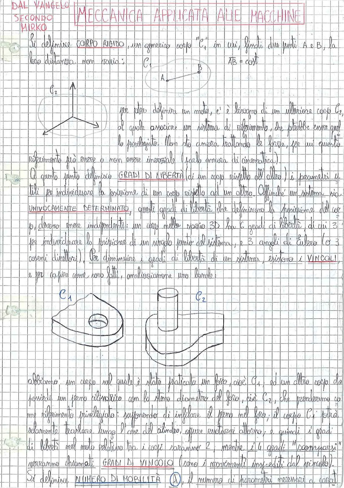

# Page 1 - Corpo Rigido, Gradi di Libertà, Vincoli

## DAL VANGELO SECONDO MIRKO — MECCANICA APPLICATA ALLE MACCHINE

## Corpo Rigido

Si definisce **CORPO RIGIDO**, un generico corpo $C_1$, in cui, fissati due punti A e B, la loro distanza non varia:

$$AB = \text{cost}$$

> 

Per poter definire un moto, c'è bisogno di un ulteriore corpo $C_2$, al quale associare un sistema di riferimento, che potrebbe essere qual le privilegiato. Non sto ancora trattando le forze, per cui questo riferimento può essere o non essere inerziale (parlo ancora di cinematica).

## Gradi di Libertà

A questo punto definiamo **GRADI DI LIBERTÀ** (di un corpo rispetto all'altro), i parametri utili per individuare la posizione di un corpo rispetto ad un altro. Affinché un sistema sia **UNIVOCAMENTE DETERMINATO**, questi gradi di libertà, che definiscono la posizione del corpo, devono essere indipendenti: un corpo nello spazio 3D ha 6 gradi di libertà, di cui 3 per individuare la posizione di un singolo punto del sistema, e 3 angoli di Eulero (o 3 coseni direttori). Per diminuire i gradi di libertà di un sistema, esistono i **VINCOLI** e per capire come sono fatti, analizziamo una bornola:

## Vincoli — Esempio: Perno in Foro (Bornola)

> 

Abbiamo un corpo sul quale è stato praticato un foro, cioè $C_1$, ed un altro corpo che possiede un perno cilindrico con lo stesso diametro del foro, cioè $C_2$, che prenderemo come riferimento privilegiato: supponendo di infilare il perno nel foro, il corpo $C_1$ potrà solamente traslare lungo l'asse del cilindro, oppure ruotarci attorno; e quindi i gradi di libertà nel moto relativo tra i corpi saranno 2, mentre i 4 gradi "scomparsi" verranno chiamati **GRADI DI VINCOLO** (sono i movimenti impediti dal vincolo).

## Numero di Mobilità

Si definisce **NUMERO DI MOBILITÀ** ($\Delta$), il numero di parametri necessari a descri-
