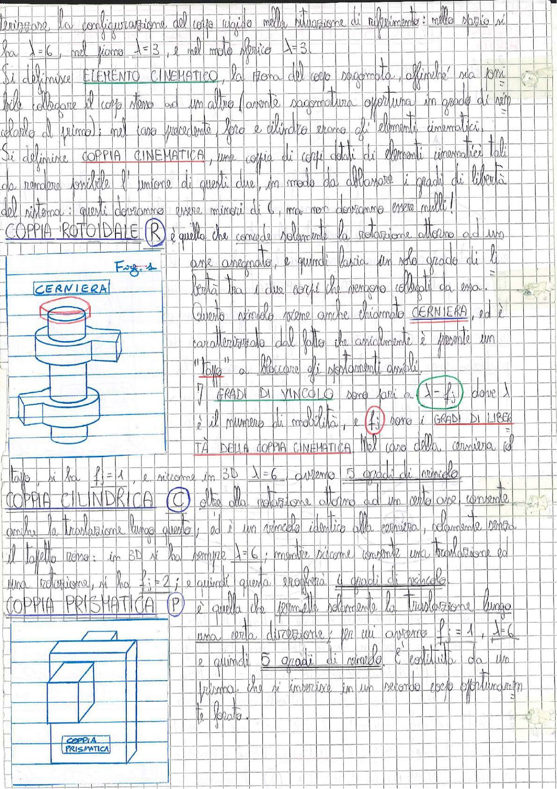

# Page 2 - Coppie Cinematiche (Elementi Cinematici e Vincoli)

terizzare la configurazione del corpo rigido nella situazione di riferimento: nello spazio si ha $\lambda = 6$, nel piano $\lambda = 3$, e nel moto sferico $\lambda = 3$.

Si definisce **ELEMENTO CINEMATICO**, la zona del corpo sagomata, affinché sia possibile collegare il corpo stesso ad un altro (avente sagomatura opportuna) in grado di vincidarlo al (primo); nel caso precedente, foro e cilindro erano gli elementi cinematici.

Si definisce **COPPIA CINEMATICA**, una copia di corpi dotati di elementi cinematici tali da rendere possibile l'unione di questi due, in modo da abbassare i gradi di libertà del sistema: questi dovranno essere minori di 6, ma non dovranno essere nulli!

## COPPIA ROTOIDALE (R)

è quella che consente solamente la rotazione attorno ad un asse assegnato, e quindi lascia un solo grado di libertà tra i due corpi che vengono collegati da essa.

Questo vincolo viene anche chiamato **CERNIERA**, ed è caratterizzato dal fatto che assialmente è presente un "tappo" a bloccare gli spostamenti assiali.

> 
>
> **Fig. 1 - CERNIERA**: Disegno di una cerniera (coppia rotoidale) con tappo assiale visibile in sezione.

I **GRADI DI VINCOLO** sono pari a $\lambda - f_j$ dove $\lambda$ è il numero di mobilità, e $f_j$ sono i **GRADI DI LIBERTÀ DELLA COPPIA CINEMATICA**. Nel caso della cerniera ed tappo, si ha $f_j = 1$, e siccome in 3D $\lambda = 6$ avremo 5 gradi di vincolo.

## COPPIA CILINDRICA (C)

oltre alla rotazione attorno ad un certo asse, consente anche la traslazione lungo questo; ed è un vincolo identico alla cerniera, chiaramente senza il tassello naso: in 3D si ha sempre $\lambda = 6$; mentre siccome consente una traslazione ed una rotazione, si ha $f_j = 2$; e quindi questa possiede 4 gradi di vincolo.

## COPPIA PRISMATICA (P)

è quella che permette solamente la traslazione lungo una certa direzione; per cui avremo $f_j = 1$, $\lambda = 6$ e quindi 5 gradi di vincolo. È costituita da un prisma che si inserisce in un recesso corpo opportunamente forato.

> 
>
> **COPPIA PRISMATICA**: Disegno di un prisma che si inserisce in un corpo forato, rappresentando il vincolo prismatico.
