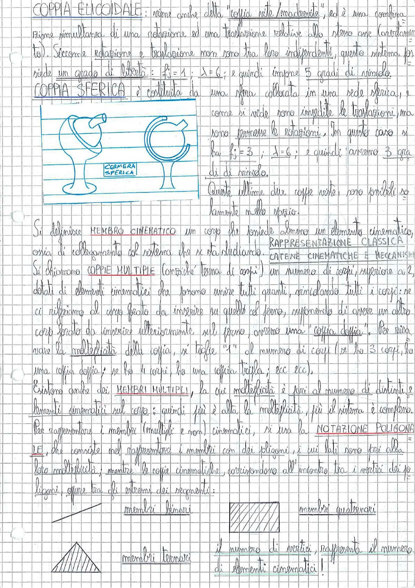

# Page 3 - Coppia Elicoidale, Coppia Sferica, Membri e Coppie Cinematiche

## Coppia Elicoidale

COPPIA ELICOIDALE: viene anche detta "coppia vite/madrevite", ed è una combinazione simultanea di una rotazione ed una traslazione relative allo stesso asse (corrispondente). Siccome rotazione e traslazione non sono tra loro indipendenti, questo sistema possiede un grado di libertà: $f_s = 1$; $\lambda = 6$; e quindi impone 5 gradi di vincolo.

## Coppia Sferica

COPPIA SFERICA è costituita da una sfera collocata in una sede sferica, e come si vede sono impedite le traslazioni, ma sono permesse le rotazioni. In questo caso si ha $f_s = 3$; $\lambda = 6$; e quindi avremo 3 gradi di vincolo.

Queste ultime due coppie viste, sono possibili solamente nello spazio.

> 

## Membro Cinematico

Si definisce MEMBRO CINEMATICO un corpo che possiede almeno un elemento cinematico, ossia di collegamento col sistema che si sta studiando.

## Rappresentazione Classica - Catene Cinematiche e Meccanismi

Si chiamano COPPIE MULTIPLE (comunque terne di corpi) un numero di corpi, superiore a 2, dotati di elementi cinematici che possono unire tutti quanti, vincolando tutti i corpi: se ci riferiamo al corpo forato da inserire su quello ed ferro, supponendo di avere un altro corpo forato da inserire ulteriormente sul perno, avremo una "coppia doppia". Per ricavare la molteplicità della coppia, si toglie "1" al numero di corpi (se ho 3 corpi, ho una coppia doppia; se ho 4 corpi, ho una coppia tripla; ecc ecc).

Esistono anche dei MEMBRI MULTIPLI, la cui molteplicità è pari al numero di distinti elementi cinematici sul corpo; quindi più è alta la molteplicità, più il sistema è complesso.

## Notazione Poligonale

Per rappresentare i membri (multipli e non) cinematici, si usa la NOTAZIONE POLIGONALE, che consiste nel rappresentare i membri con dei poligoni, i cui lati sono pari alla loro molteplicità; mentre le coppie cinematiche, corrispondono all'incontro tra i vertici dei poligoni, oppure tra gli estremi dei segmenti:

- **membri binari** (segmento)
- **membri ternari** (triangolo)
- **membri quaternari** (quadrilatero)

> 

Il numero di vertici, rappresenta il numero di elementi cinematici!
