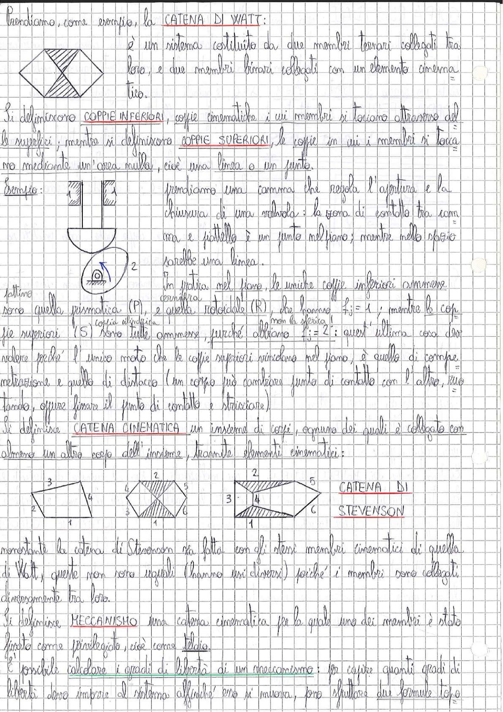

# Page 4 - Catena di Watt, Coppie Cinematiche e Catena Cinematica

Prendiamo, come esempio, la **CATENA DI WATT**:

> 
> Diagramma: rappresentazione della catena di Watt con membro ternario (forma a diamante).

È un sistema costituito da due membri ternari collegati tra loro, e due membri binari collegati con un elemento cinematico.

Si definiscono **COPPIE INFERIORI**, coppie cinematiche i cui membri si toccano attraverso delle superfici; mentre si definiscono **COPPIE SUPERIORI**, le coppie in cui i membri si toccano mediante un'area nulla, cioè una linea o un punto.

**Esempio:**

> 
> Diagramma 1: camma prismatica - la zona di contatto tra camma e piattello è un punto nel piano; mentre nello spazio sarebbe una linea.
> Diagramma 2: camma con profilo circolare.

Prendiamo una camma che regola l'apertura e la chiusura di una valvola: la zona di contatto tra camma e piattello è un punto nel piano; mentre nello spazio sarebbe una linea.

In pratica nel piano, le uniche coppie inferiori ammesse sono quella prismatica (P), e quella rotoidale (R), che hanno $f_j = 1$; mentre le coppie superiori (S) sono tutte ammesse, purché abbiano $f_j = 2$; quest'ultima cosa deve valere perché l'unico moto che le coppie superiori vincolano nel piano, è quello di compenetrazione e quello di distacco (un corpo può cambiare punto di contatto con l'altro, può rotolare, oppure lisciare il punto di contatto e strisciare).

*(coppia cilindrica)*
*(non la sferica!)*

Si definisce **CATENA CINEMATICA** un insieme di coppie, ognuna dei quali è collegata con almeno un altro corpo dell'insieme, tramite elementi cinematici:

> 
> Diagrammi: diverse catene cinematiche - catena a 4 membri, catena a 4 membri con membro ternario, catena con membri multipli, e la **CATENA DI STEVENSON** (con 5-6 membri).

Nonostante la catena di Stevenson sia fatta con gli stessi membri cinematici di quella di Watt, queste non sono uguali (hanno usi diversi) perché i membri sono collegati diversamente tra loro.

Si definisce **MECCANISMO** una catena cinematica per la quale uno dei membri è stato fissato come parallelaggio, cioè come **telaio**.

È possibile calcolare i gradi di libertà di un meccanismo: per capire quanti gradi di libertà devo imporre al sistema affinché esso si muova, sono sfuttate due formule tipo
