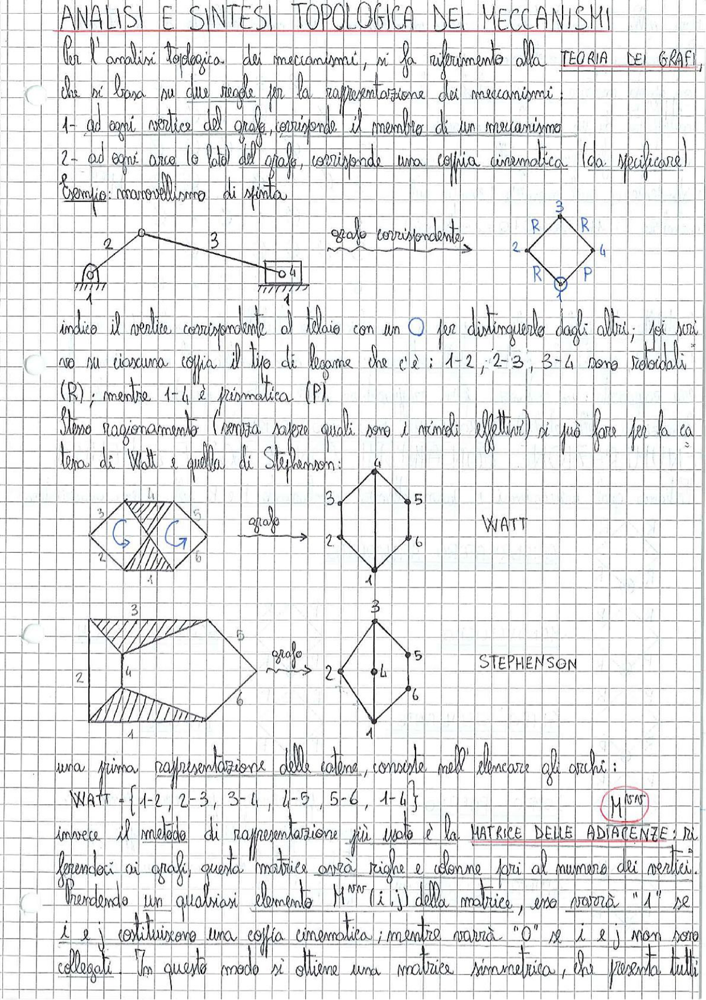

# Page 5 - Analisi e Sintesi Topologica dei Meccanismi

## ANALISI E SINTESI TOPOLOGICA DEI MECCANISMI

Per l'analisi topologica dei meccanismi, si fa riferimento alla **TEORIA DEI GRAFI**, che si basa su due regole per la rappresentazione dei meccanismi:

1. ad ogni vertice del grafo, corrisponde il membro di un meccanismo
2. ad ogni arco (o lato) del grafo, corrisponde una coppia cinematica (da specificare)

**Esempio:** manovellismo di spinta

> 

Indico il vertice corrispondente al telaio con un ○ per distinguerlo dagli altri; poi scrivo su ciascuna coppia il tipo di legame che c'è: 1-2, 2-3, 3-4 sono rotoidali (R); mentre 1-4 è prismatica (P).

Stesso ragionamento (senza sapere quali sono i vincoli effettivi) si può fare per la catena di Watt e quella di Stephenson:

> 

**WATT**

> 

**STEPHENSON**

Una prima rappresentazione delle catene, consiste nell'elencare gli archi:

$$\text{WATT} = \{1\text{-}2,\ 2\text{-}3,\ 3\text{-}4,\ 4\text{-}5,\ 5\text{-}6,\ 1\text{-}4\}$$

Invece il metodo di rappresentazione più usato è la **MATRICE DELLE ADIACENZE**: $M^{n \times n}$

Riferendoci ai grafi, questa matrice avrà righe e colonne pari al numero dei vertici.

Prendendo un qualsiasi elemento $M^{n \times n}(i,j)$ della matrice, esso varrà "1" se $i$ e $j$ costituiscono una coppia cinematica; mentre varrà "0" se $i$ e $j$ non sono collegati. In questo modo si ottiene una matrice simmetrica, che presenta tutti
