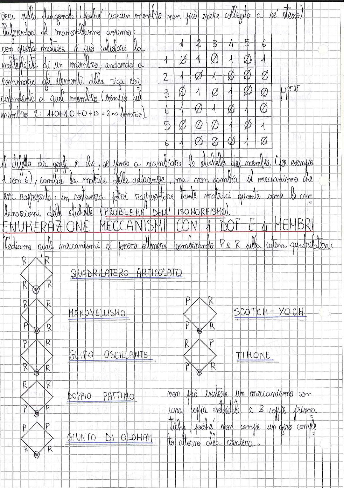

# Page 6 - Enumerazione Meccanismi con 1 DOF e 4 Membri

Zeri sulla diagonale (poiché ciascun membro non può essere collegato a sé stesso).

Riferiamoci al manovellismo esterno:

Con questa matrice si può calcolare la molteplicità di un membro, andando a sommare gli elementi della riga corrispondente a quel membro (esempio sul membro 2: $1+0+1+0+0 = 2 \rightarrow$ binario).

|   | 1 | 2 | 3 | 4 | 5 | 6 |
|---|---|---|---|---|---|---|
| 1 | ∅ | 1 | ∅ | 1 | ∅ | 1 |
| 2 | 1 | ∅ | 1 | ∅ | ∅ | ∅ |
| 3 | ∅ | 1 | ∅ | 1 | ∅ | ∅ |
| 4 | 1 | ∅ | 1 | ∅ | 1 | ∅ |
| 5 | ∅ | ∅ | ∅ | 1 | ∅ | 1 |
| 6 | 1 | ∅ | ∅ | ∅ | 1 | ∅ |

$$M^{ris}$$

Il difetto dei grafi è che, se provo a scambiare le etichette dei membri (per esempio 1 con 6), cambia la matrice delle adiacenze, ma non cambia il meccanismo che essa rappresenta: in sostanza potrei rappresentare tante matrici quante sono le combinazioni delle etichette (PROBLEMA DELL'ISOMORFISMO).

## ENUMERAZIONE MECCANISMI CON 1 DOF E 4 MEMBRI

Vediamo quali meccanismi si possono ottenere combinando P e R sulla catena quadrilatera:

> 
>
> Diagrammi dei meccanismi con 4 membri e 1 DOF, rappresentati come quadrilateri con coppie rotoidali (R) e prismatiche (P) ai vertici:

### QUADRILATERO ARTICOLATO

R - R - R - R (tutte coppie rotoidali)

### MANOVELLISMO

R - R - P - R (una coppia prismatica)

### SCOTCH-YOKE

P - R - P - R (due coppie prismatiche opposte)

### GLIFO OSCILLANTE

P - R - R - R (una coppia prismatica)

### TIRONE

R - P - P - R (due coppie prismatiche adiacenti)

### DOPPIO PATTINO

R - R - P - P (due coppie prismatiche adiacenti)

### GIUNTO DI OLDHAM

P - P - R - R (due coppie prismatiche adiacenti)

Non può esistere un meccanismo con una coppia rotoidale e 3 coppie prismatiche, poiché non compie un giro completo attorno alla cerniera.
