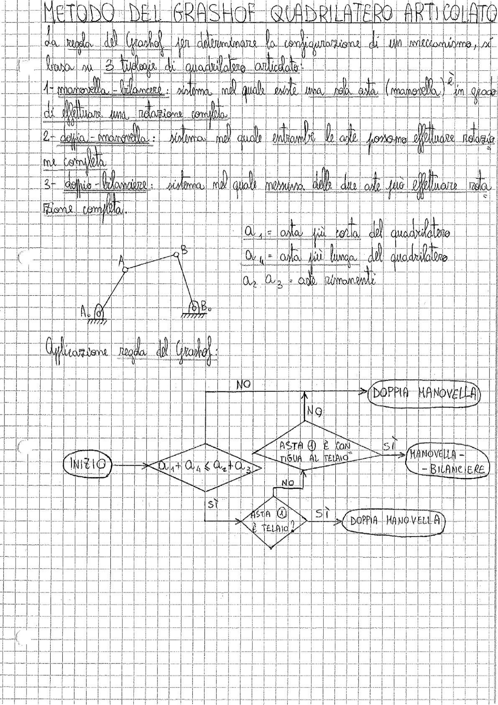

# Page 7 - Metodo del Grashof - Quadrilatero Articolato

## METODO DEL GRASHOF QUADRILATERO ARTICOLATO

La regola del Grashof per determinare la configurazione di un meccanismo, si basa su 3 tipologie di quadrilatero articolato:

1. **manovella - bilanciere**: sistema nel quale esiste una sola asta (manovella) in grado di effettuare una rotazione completa.

2. **doppia - manovella**: sistema nel quale entrambe le aste possono effettuare rotazione completa.

3. **doppio - bilanciere**: sistema nel quale nessuna delle due aste può effettuare rotazione completa.

> 
>
> Diagramma di un quadrilatero articolato con i punti A, B, $A_0$ e $B_0$ che rappresentano i vincoli a telaio.

$a_1$ = asta più corta del quadrilatero

$a_4$ = asta più lunga del quadrilatero

$a_2$, $a_3$ = aste rimanenti

## Applicazione regola del Grashof:

> 
>
> Diagramma di flusso per l'applicazione della regola del Grashof:
>
> - **INIZIO** → Verifica: $a_1 + a_4 \leq a_2 + a_3$ ?
>   - **NO** → DOPPIA MANOVELLA
>   - **SÌ** → Verifica: Asta ① è telaio?
>     - **SÌ** → DOPPIA MANOVELLA
>     - **NO** → Verifica: Asta ① è contigua al telaio?
>       - **SÌ** → MANOVELLA - BILANCIERE
>       - **NO** → DOPPIA MANOVELLA
