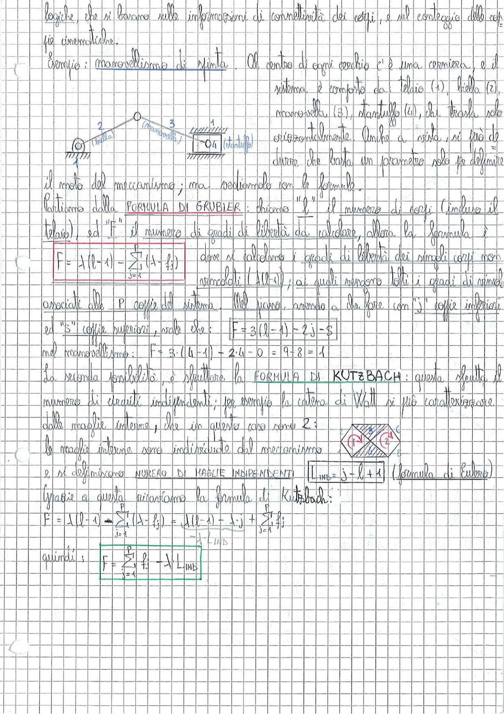

# Page 9 - Formula di Grubler e Formula di Kutzbach

logiche, che si basano sulle informazioni di connettività dei corpi, e sul conteggio delle coppie cinematiche.

## Esempio: manovellismo di spinta

Al centro di ogni occhio c'è una cerniera, e il sistema è composto da: telaio (1), biella (2), manovella (3), stantuffo (4), che trasla solo orizzontalmente. Anche a vista, si può dire che basta un parametro solo per definire il moto del meccanismo; ma vediamolo con le formule.

> 

## Formula di Grubler

Partiamo dalla **FORMULA DI GRUBLER**: chiamo "$l$" il numero di corpi (incluso il telaio), ed "$F$" il numero di gradi di libertà da calcolare, allora la formula è

$$F = \lambda(l - 1) - \sum_{j=1}^{P}(\lambda - f_j)$$

dove si calcolano i gradi di libertà dei singoli corpi non vincolati ($\lambda(l-1)$); ai quali vengono tolti i gradi di vincolo associati alle $P$ coppie del sistema. Nel piano, avendo a che fare con "$j$" coppie inferiori ed "$S$" coppie superiori, vale che:

$$F = 3(l-1) - 2j - s$$

nel manovellismo: $F = 3 \cdot (4-1) - 2 \cdot 4 - 0 = 9 - 8 = 1$

## Formula di Kutzbach

La seconda possibilità, è sfruttare la **FORMULA DI KUTZBACH**: questa sfrutta il numero di circuiti indipendenti; per esempio la catena di Watt si può caratterizzare dalle maglie interne, che in questo caso sono 2;

> 

le maglie interne sono individuate dal meccanismo e si definiscono **NUMERO DI MAGLIE INDIPENDENTI**:

$$L_{IND} = j - l + 1 \quad \text{(formula di Eulero)}$$

Grazie a questa ritroviamo la formula di Kutzbach:

$$F = \lambda(l-1) - \sum_{j=1}^{P}(\lambda - f_j) = \lambda(l-1) + \lambda \cdot j + \sum_{j=1}^{P} f_j$$

quindi:

$$\boxed{F = \sum_{j=1}^{P} f_j - \lambda \cdot L_{IND}}$$
