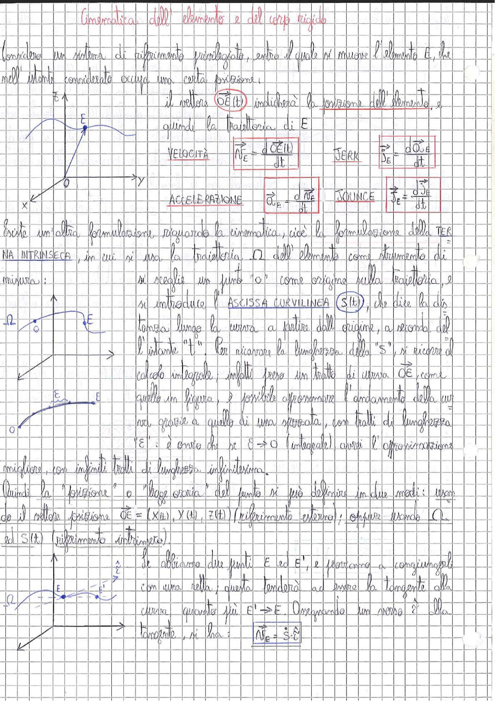

# Page 10 - Cinematica dell'elemento e del corpo rigido

Considero un sistema di riferimento privilegiato, entro il quale si muove l'elemento E, che nell'istante considerato occupa una certa posizione.

> 
> Diagramma: sistema di riferimento cartesiano (x, y, z) con origine O e traiettoria curvilinea del punto E.

Il vettore $\vec{OE}(t)$ indicherà la posizione dell'elemento, e quindi la traiettoria di E.

$$\text{VELOCITÀ} \qquad \vec{V}_E = \frac{d\,\vec{OE}(t)}{dt}$$

$$\text{JERK} \qquad \vec{J}_E = \frac{d\,\vec{a}_E}{dt}$$

$$\text{ACCELERAZIONE} \qquad \vec{a}_E = \frac{d\,\vec{V}_E}{dt}$$

$$\text{JOUNCE} \qquad \vec{J}_E = \frac{d\,\vec{J}_E}{dt}$$

Esiste un'altra formulazione riguardo la cinematica, cioè la formulazione della **TERNA INTRINSECA**, in cui si usa la traiettoria $\Omega$ dell'elemento come strumento di misura:

si sceglie un punto "O" come origine sulla traiettoria, e si introduce l'**ASCISSA CURVILINEA** $S(t)$, che dice la distanza lungo la curva a partire dall'origine, a seconda dell'istante "t". Per ricavare la lunghezza della "S", si ricorre al calcolo integrale; infatti preso un tratto di curva $\overline{OE}$, come quello in figura, è possibile approssimare l'andamento della curva grazie a quello di una spezzata, con tratti di lunghezza "$\bar{\varepsilon}$": è ovvio che si $\bar{\varepsilon} \rightarrow 0$ (integrale) avrò l'approssimazione migliore, con infiniti tratti di lunghezza infinitesima.

> 
> Diagramma: traiettoria curvilinea $\Omega$ con origine O, punto E, e approssimazione tramite spezzata con segmenti di lunghezza $\bar{\varepsilon}$.

Quindi la "posizione" o "legge oraria" del punto si può definire in due modi: usando il vettore posizione $\vec{OE} = (X(t), Y(t), Z(t))$ (riferimento esterno); oppure usando $\Omega$ ed $S(t)$ (riferimento intrinseco).

> 
> Diagramma: traiettoria $\Omega$ con due punti E ed E', versore tangente $\hat{\tau}$, e retta congiungente che tende alla tangente quando $E' \rightarrow E$.

Se abbiamo due punti E ed E', e proviamo a congiungerli con una retta, questa tenderà ad essere la tangente alla curva quanto più $E' \rightarrow E$. Assegnando un verso è alla tangente, si ha:

$$\boxed{\vec{V}_E = \dot{S} \cdot \hat{\tau}}$$
