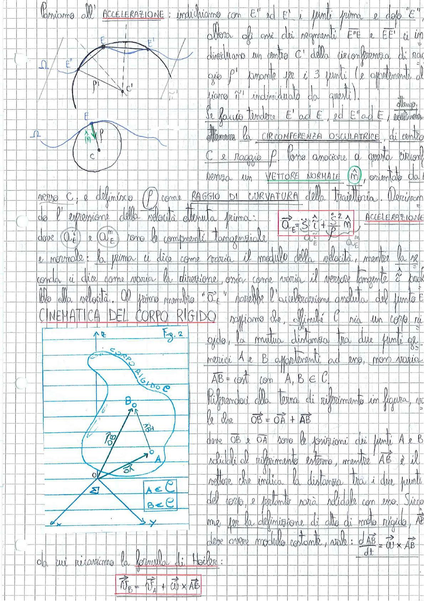

# Page 11 - Accelerazione e Cinematica del Corpo Rigido

## Accelerazione

Passiamo all'**ACCELERAZIONE**: indichiamo con $E''$ ed $E'$ i punti prima e dopo "$E$" allora gli assi dei segmenti $\overline{E''E}$ e $\overline{EE'}$ si incontreranno in un centro $C'$ della circonferenza di raggio $\rho'$ passante per i 3 punti (e oggetivamente il piano $\hat{n}'$ individuato da questi).

> 
> Diagramma: Costruzione geometrica della circonferenza osculatrice con punti E'', E, E' e centro C', e raggio ρ

Se faccio tendere $E'$ ad $E$, ed $E''$ ad $E$, ottengo allora la **CIRCONFERENZA OSCULATRICE**, di centro $C$ e raggio $\rho$. Posso associare a questa circonferenza un **VETTORE NORMALE** $\hat{m}$, orientato dal centro $C$, e definisco $\rho$ come **RAGGIO DI CURVATURA** della traiettoria.

Derivando l'espressione della velocità ottenuta prima:

$$\boxed{\vec{a}_E = \ddot{s} \cdot \hat{t} + \frac{\dot{s}^2}{\rho} \hat{m}}$$

**ACCELERAZIONE**

dove $a_E^t$ e $a_E^n$ sono le componenti tangenziale e normale: la prima ci dice come varia il modulo della velocità, mentre la seconda ci dice come varia la direzione, ossia come varia il versore tangente $\hat{t}$ parallelo alla velocità. Al primo membro "$\vec{a}_E$" sarebbe l'accelerazione assoluta del punto E.

---

## Cinematica del Corpo Rigido

**CINEMATICA DEL CORPO RIGIDO**: sappiamo che, affinché $C$ sia un corpo rigido, la mutua distanza tra due punti geometrici $A$ e $B$ appartenenti ad esso, non varia:

$$\overline{AB} = \text{cost} \quad \text{con} \quad A, B \in C$$

> 
> Diagramma: Corpo rigido nello spazio con terna di riferimento (x, y, z), punti A e B sul corpo, vettori posizione $\overrightarrow{OA}$, $\overrightarrow{OB}$ e $\overrightarrow{AB}$, con indicazione $A \in C$, $B \in C$

Riferendoci alla terna di riferimento in figura, vale che:

$$\overrightarrow{OB} = \overrightarrow{OA} + \overrightarrow{AB}$$

dove $\overrightarrow{OB}$ e $\overrightarrow{OA}$ sono le posizioni dei punti $A$ e $B$ solidali al riferimento esterno, mentre $\overrightarrow{AB}$ è il vettore che indica la distanza tra i due punti del corpo, e pertanto sarà solidale con esso. Siccome per la definizione di moto di moto rigido, $\overrightarrow{AB}$ deve avere modulo costante, vale:

$$\frac{d\overrightarrow{AB}}{dt} = \vec{\omega} \times \overrightarrow{AB}$$

da cui ricaviamo la **formula di Rivals**:

$$\boxed{\vec{v}_B = \vec{v}_A + \vec{\omega} \times \overrightarrow{AB}}$$
