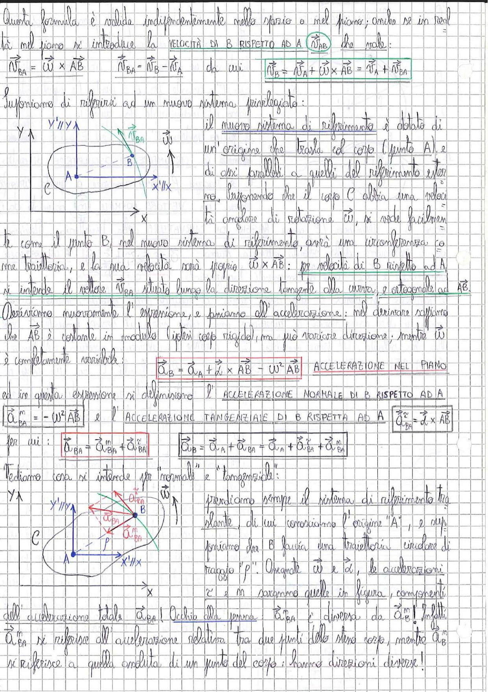

# Page 12 - Velocità e Accelerazione Relativa nel Piano

Questa formula è valida indipendentemente nello spazio o nel piano; anche se in realtà nel piano si introduce la **VELOCITÀ DI B RISPETTO AD A** $\vec{v}_{AB}$, che vale:

$$\vec{v}_{BA} = \vec{\omega} \times \vec{AB} \qquad \vec{v}_{BA} = \vec{v}_B - \vec{v}_A \qquad \text{da cui} \qquad \boxed{\vec{v}_B = \vec{v}_A + \vec{\omega} \times \vec{AB} = \vec{v}_A + \vec{v}_{BA}}$$

## Supponiamo di riferirci ad un nuovo sistema privilegiato:

> 
> Diagramma: Sistema di riferimento traslante con origine in A, assi X'//X e Y'//Y, corpo rigido con punti A e B, e vettore velocità $\vec{v}_{BA}$ e velocità angolare $\vec{\omega}$.

Il nuovo sistema di riferimento è dotato di un'origine che trasla col corpo (punto A), e di assi paralleli a quelli del riferimento esterno. Supponendo che il corpo C abbia una velocità angolare di rotazione $\vec{\omega}$, si vede facilmente come il punto B, nel nuovo sistema di riferimento, avrà una circonferenza come traiettoria, e la sua velocità sarà proprio $\vec{\omega} \times \vec{AB}$: per velocità di B rispetto ad A si intende il vettore $\vec{v}_{BA}$ situato lungo la direzione tangente alla curva, e ortogonale ad $\vec{AB}$.

## Accelerazione nel Piano

Deriviamo nuovamente l'espressione, e passiamo all'accelerazione: nel derivare sappiamo che $\vec{AB}$ è costante in modulo (ipotesi corpo rigido), ma può variare direzione; mentre $\vec{\omega}$ è completamente variabile:

$$\boxed{\vec{a}_B = \vec{a}_A + \dot{\vec{\omega}} \times \vec{AB} - \omega^2 \vec{AB}} \quad \text{ACCELERAZIONE NEL PIANO}$$

ed in questa espressione si definiscono l'**ACCELERAZIONE NORMALE DI B RISPETTO AD A**

$$\boxed{\vec{a}_{BA}^{\,n} = -\omega^2 \vec{AB}}$$

e l'**ACCELERAZIONE TANGENZIALE DI B RISPETTA AD A**:

$$\boxed{\vec{a}_{BA}^{\,\tau} = \dot{\vec{\omega}} \times \vec{AB}}$$

per cui:

$$\vec{a}_{BA} = \vec{a}_{BA}^{\,n} + \vec{a}_{BA}^{\,\tau} \qquad \boxed{\vec{a}_B = \vec{a}_A + \vec{a}_{BA} = \vec{a}_A + \vec{a}_{BA}^{\,\tau} + \vec{a}_{BA}^{\,n}}$$

## Significato di "normale" e "tangenziale"

> 
> Diagramma: Sistema di riferimento traslante con origine in A, punto B su traiettoria circolare di raggio $\rho$, con scomposizione dell'accelerazione $\vec{a}_{BA}$ nelle componenti normale $\vec{a}_{BA}^n$ (diretta verso A) e tangenziale $\vec{a}_{BA}^\tau$ (tangente alla traiettoria), con vettori $\vec{\omega}$ e $\dot{\vec{\omega}}$.

Prendiamo sempre il sistema di riferimento traslante, di cui conosciamo l'origine "A", e supponiamo che B faccia una traiettoria circolare di raggio "$\rho$". Assegnate $\vec{\omega}$ e $\dot{\vec{\omega}}$, le accelerazioni $\tau$ e $n$ saranno quelle in figura, componenti dell'accelerazione totale $\vec{a}_{BA}$!

Occhio alla penna: $\vec{a}_{BA}^{\,n}$ è diversa da $\vec{a}_B^{\,n}$! Infatti $\vec{a}_{BA}^{\,n}$ si riferisce all'accelerazione relativa tra due punti dello stesso corpo, mentre $\vec{a}_B^{\,n}$ si riferisce a quella assoluta di un punto del corpo: hanno direzioni diverse!
