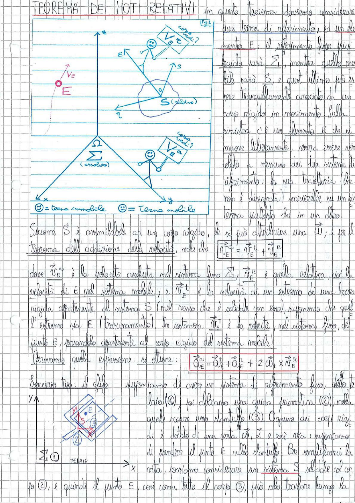

# Page 13 - Teorema dei Moti Relativi

## TEOREMA DEI MOTI RELATIVI

In questo teorema dovremo considerare due terne di riferimento, ed un elemento E: il riferimento fisso (primo) logico sarà $\Sigma$, mentre quello mobile sarà $S$, e quest'ultimo può essere tranquillamente associato ad un corpo rigido in movimento. Sulla sinistra c'è un elemento E che si muove liberamente, senza essere vincolato a nessuno dei due sistemi di riferimento; la sua traiettoria (che non è disegnata) varierà su un tipo di terna piuttosto che in un altro.

> 
> Diagramma: Due sistemi di riferimento — una terna immobile $\Sigma$ (assoluto) con assi $x$ e un sistema mobile $S$ (relativo) rappresentato come corpo rigido con velocità angolare $\Omega$. Un elemento E è mostrato con la sua velocità $\vec{V}_E$. Il sistema mobile $S$ ha una velocità $\vec{V}_E^c$ nel punto E. Una seconda figura mostra l'esercizio tipo con un telaio ①, una guida prismatica ② e uno stantuffo ③ con il punto E.

☺ = terna immobile &emsp; ☻ = terna mobile

---

Siccome S è assimilabile ad un corpo rigido, le si può attribuire una $\vec{\omega}$; e per il **Teorema dell'addizione delle velocità**, vale che:

$$\boxed{\vec{V}_E^{a} = \vec{V}_E^{t} + \vec{V}_E^{R}}$$

dove $\vec{V}_E^{a}$ è la velocità assoluta nel sistema fisso $\Sigma$; $\vec{V}_E^{R}$ è quella relativa, cioè la velocità di E nel sistema mobile; e $\vec{V}_E^{t}$ è la velocità di un estremo di una traccia rigida appartenente al sistema S (nel senso che è solidale con esso), supponendo che quell'estremo sia E (trascinamento). In sostanza $\vec{V}_E^{t}$ è la velocità, nel sistema fisso, del punto E, pensandolo appartenente al corpo rigido del sistema mobile!

Derivando quella espressione si ottiene:

$$\boxed{\vec{a}_{E}^{a} = \vec{a}_E^{t} + \vec{a}_E^{R} + 2\vec{\omega}_E \times \vec{V}_E^{R}}$$

---

## Esercizio tipo: il dito

Supponiamo di avere un sistema di riferimento fisso, detto telaio ①; poi abbiamo una guida prismatica (②), nella quale scorre uno stantuffo (③). Ognuno dei corpi rigidi è dotato di una certa $\vec{\omega}$, $\dot{\vec{\omega}}$ e così via; supponiamo di pensare il punto E sullo stantuffo. Per semplificarci la vita, possiamo considerare un sistema S solidale col corpo ②, e quindi il punto E, così come tutto il corpo ③, può solo traslare lungo la
