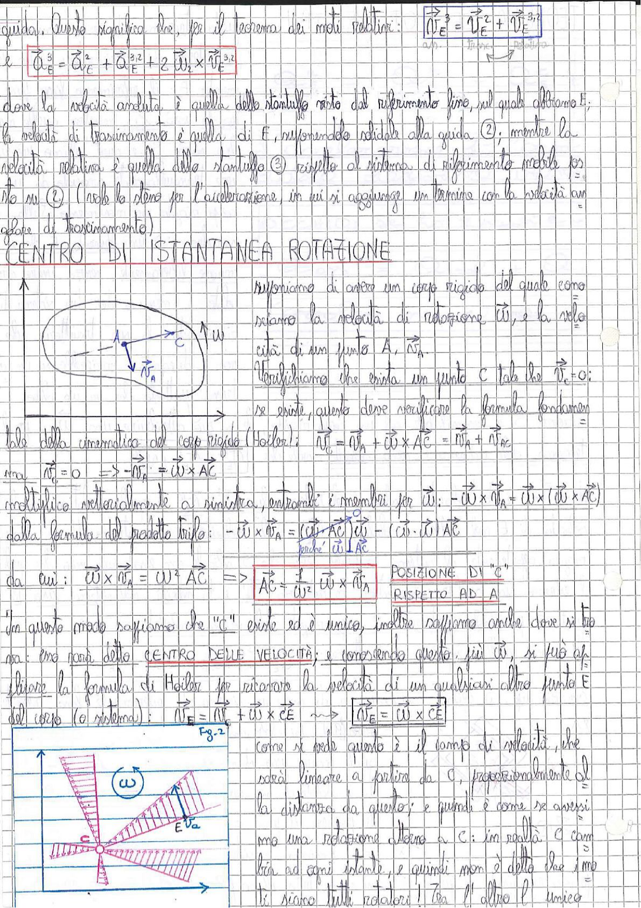

# Page 14 - Centro di Istantanea Rotazione

guida. Questo significa che, per il teorema dei moti relativi:

$$\boxed{\vec{v}_E^3 = \vec{v}_E^2 + \vec{v}_E^{3,2}}$$

e $\quad \vec{a}_E^3 = \vec{a}_E^2 + \vec{a}_E^{3,2} + 2\vec{\omega}_2 \times \vec{v}_E^{3,2}$

dove la velocità assoluta è quella dello stantuffo visto dal riferimento fisso, nel quale abbiamo E; la velocità di trascinamento è quella di E, supponendo solidale alla guida ②, mentre la velocità relativa è quella dello stantuffo ③ rispetto al sistema di riferimento mobile posto su ② (vale lo stesso per l'accelerazione, in cui si aggiunge un termine con la velocità un valore di trascinamento)

## CENTRO DI ISTANTANEA ROTAZIONE

> 
> Diagramma: Corpo rigido con punto A, punto C e vettori velocità $\vec{v}_A$, velocità angolare $\vec{\omega}$

Supponiamo di avere un corpo rigido del quale conosciamo la velocità di rotazione $\vec{\omega}$, e la velocità di un punto A, $\vec{v}_A$.

Verifichiamo che esista un punto C tale che $\vec{v}_C = 0$; se esiste, questo deve verificare la formula fondamentale della cinematica del corpo rigido (Euler):

$$\vec{v}_C = \vec{v}_A + \vec{\omega} \times \vec{AC} = \vec{v}_A + \vec{v}_{AC}$$

ma $\vec{v}_C = 0 \quad \Rightarrow \quad -\vec{v}_A = \vec{\omega} \times \vec{AC}$

moltiplico vettorialmente a sinistra, entrambi i membri per $\vec{\omega}$: $-\vec{\omega} \times \vec{v}_A = \vec{\omega} \times (\vec{\omega} \times \vec{AC})$

dalla formula del prodotto triplo: $-\vec{\omega} \times \vec{v}_A = (\vec{\omega} \cdot \vec{AC})\vec{\omega} - (\vec{\omega} \cdot \vec{\omega})\vec{AC}$

(il primo termine è nullo perché $\vec{\omega} \perp \vec{AC}$)

da cui: $\vec{\omega} \times \vec{v}_A = \omega^2 \vec{AC} \quad \Rightarrow$

$$\boxed{\vec{AC} = \frac{1}{\omega^2} \vec{\omega} \times \vec{v}_A} \quad \text{POSIZIONE DI "C" RISPETTO AD A}$$

In questo modo sappiamo che "C" esiste ed è unico, inoltre sappiamo anche dove si trova: esso è detto **CENTRO DELLE VELOCITÀ**; e conoscendo questo, più $\vec{\omega}$, si può applicare la formula di Euler per ricavare la velocità di un qualsiasi altro punto E del corpo (o sistema):

$$\vec{v}_E = \vec{v}_C + \vec{\omega} \times \vec{CE} \quad \Rightarrow \quad \boxed{\vec{v}_E = \vec{\omega} \times \vec{CE}}$$

> 
> Diagramma (Fig. 2): Campo di velocità lineare a partire dal centro di istantanea rotazione C, con velocità angolare $\omega$, mostrante velocità proporzionali alla distanza da C per diversi punti E

Come si vede questo è il campo di velocità, che sarà lineare a partire da C, proporzionalmente alla distanza da questo; e quindi è come se avessimo una rotazione attorno a C: in realtà C cambia ad ogni istante, e quindi non è detto che i moti siano tutti rotatori! Tra l'altro è unico.
