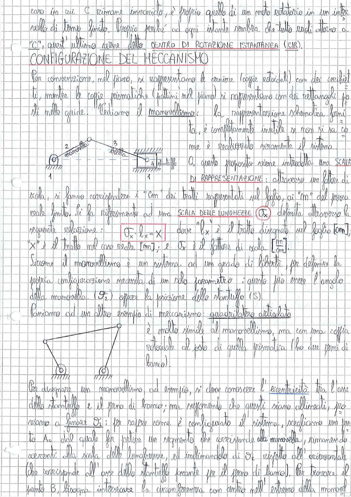

# Page 15 - Configurazione del Meccanismo

caso in cui C rimane invariato, è proprio quello di un moto rotatorio in un intervallo di tempo finito. Proprio perché ad ogni istante sembra che tutto ruoti attorno a "C", quest'ultimo viene detto **CENTRO DI ROTAZIONE ISTANTANEA (CIR)**.

## CONFIGURAZIONE DEL MECCANISMO

Per convenzione, nel piano, si rappresentano le cerniere (coppie rotoidali) con dei cerchietti, mentre le coppie prismatiche (pattini nel piano) si rappresentano con dei rettangoli fissati nelle guide. Vediamo il manovellismo: la rappresentazione schematica fornita, è completamente inutile se non si sa come è realizzato veramente il sistema.

> 
> Diagramma: Schema cinematico di un manovellismo di spinta con manovella (membro 2), biella (membro 3), stantuffo (membro 4) e telaio (membro 1). Le cerniere sono rappresentate con cerchietti e la coppia prismatica con un rettangolo.

A questo proposito viene introdotta una **SCALA DI RAPPRESENTAZIONE**: attraverso un fattore di scala, si fanno corrispondere i "cm" dei tratti rappresentati sul foglio, ai "m" del pezzo reale finito. Si fa riferimento ad una **SCALA DELLE LUNGHEZZE** $\alpha_x$ definita attraverso la seguente relazione:

$$\boxed{\alpha_x \cdot l_x = X}$$

dove $l_x$ è il tratto disegnato sul foglio [cm]; "X" è il tratto nel caso reale [m]; e $\alpha_x$ è il fattore di scala $\left[\frac{m}{cm}\right]$.

Siccome il manovellismo è un sistema ad un grado di libertà, per definire la prima configurazione necessita di un solo parametro: questo può essere l'angolo della manovella ($\vartheta_2$) oppure la posizione dello stantuffo ($S$).

Passiamo ad un altro esempio di meccanismo: **quadrilatero articolato**.

> 
> Diagramma: Schema cinematico di un quadrilatero articolato, molto simile al manovellismo ma con una coppia rotoidale al posto di quella prismatica (ha due perni di banco).

È molto simile al manovellismo, ma con una coppia rotoidale al posto di quella prismatica (ha due perni di banco).

Per disegnare un manovellismo, ad esempio, si deve conoscere l'eccentricità tra l'asse dello stantuffo e il perno di banco; ma supponendo che questi siano allineati, poniamo a fissare $\vartheta_2$: per sapere come è configurato il sistema, scegliamo un punto $A_0$ dal quale far partire un segmento che corrisponde alla manovella, rispettando le correnti alla scala delle lunghezze, ed inclinandolo di $\vartheta_2$ rispetto all'orizzontale (che corrisponde all'asse dello stantuffo ovvero per il perno di banco). Per trovare il punto B, bisogna intersecare la circonferenza con centro nell'estremo della manovel-
