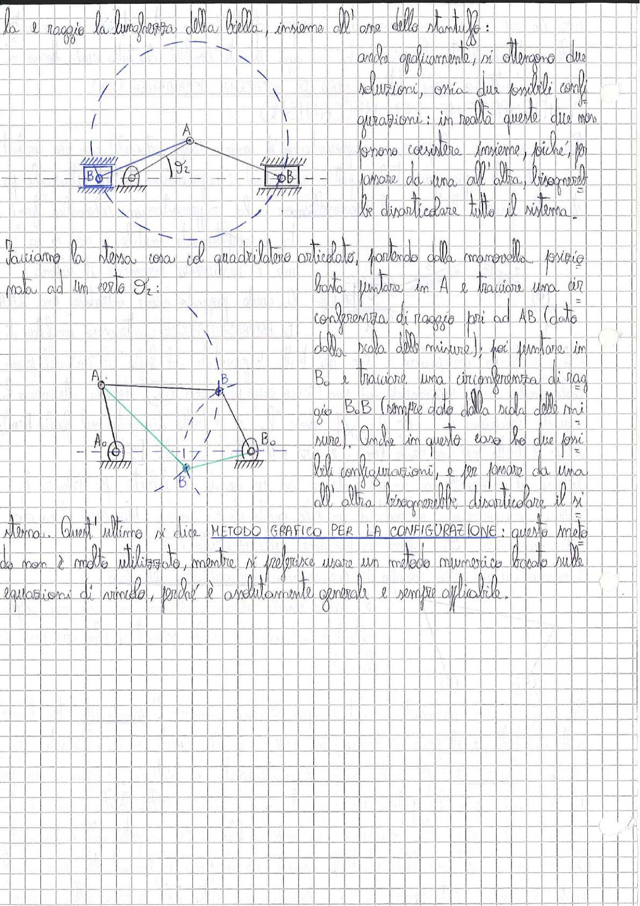

# Page 16 - Metodo Grafico per la Configurazione

la e raggio la lunghezza della biella, insieme all'asse dello stantuffo:

> 
> Diagramma: Meccanismo biella-manovella con costruzione grafica. Si mostra il punto $B_0$ (centro di rotazione della manovella), il punto $A$ (estremità della biella) e il punto $B$ (piede di biella/stantuffo) sull'asse orizzontale. Una circonferenza tratteggiata di raggio pari alla lunghezza della biella è centrata in $A$, mostrando le due possibili posizioni di $B$. L'angolo $\vartheta_2$ è indicato sulla manovella.

anche graficamente, si ottengono due soluzioni, ossia due possibili configurazioni: in realtà queste due non possono coesistere insieme, poiché, per passare da una all'altra, bisognerebbe disarticolare tutto il sistema.

---

Facciamo la stessa cosa col quadrilatero articolato, portando dalla manovella, posizionata ad un certo $\vartheta_2$:

basta puntare in A e tracciare una circonferenza di raggio pari ad AB (dato dalla scala delle misure); poi puntare in $B_0$ e tracciare una circonferenza di raggio $B_0 B$ (sempre dato dalla scala delle misure). Anche in questo caso ho due possibili configurazioni, e per passare da una all'altra bisognerebbe disarticolare il sistema.

> 
> Diagramma: Quadrilatero articolato con punti $A_0$, $A$, $B$, $B_0$ e il telaio tra $A_0$ e $B_0$ (tratteggiato a terra). Sono mostrate le due possibili configurazioni del meccanismo: una con la biella sopra il telaio e una sotto (punto $B'$). Le due circonferenze (centrate in $A$ e in $B_0$) si intersecano nei due punti soluzione.

---

Quest'ultimo si dice **METODO GRAFICO PER LA CONFIGURAZIONE**: questo metodo non è molto utilizzato, mentre si preferisce usare un metodo numerico basato sulle equazioni di vincolo, perché è assolutamente generale e sempre applicabile.
