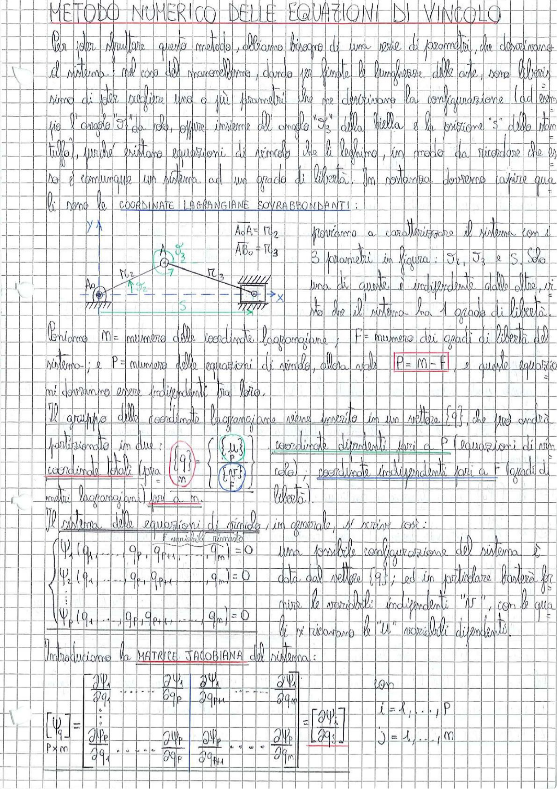

# Page 17 - Metodo Numerico delle Equazioni di Vincolo

## Introduzione

Per poter sfruttare questo metodo, abbiamo bisogno di una serie di parametri, che descrivano il sistema: nel caso del manovellismo, dovendo per fissate le lunghezze delle aste, sono liberi, siamo di poter scegliere uno o più parametri che ne descrivano la configurazione (ad esempio l'angolo $\vartheta_2$ da "solo", oppure insieme all'angolo $\vartheta_3$ della biella e la posizione "$S$" dello stantuffo), purché esistano equazioni di vincolo che li leghino, in modo da ricordare che esso è comunque un sistema ad un grado di libertà. In sostanza dovremo capire quali sono le **COORDINATE LAGRANGIANE SOVRABBONDANTI**.

> 
> Diagramma: Schema del manovellismo biella-manovella con indicazione delle coordinate lagrangiane $\vartheta_2$, $\vartheta_3$ e $S$, con punto $A_0$ fisso, punto $A$ alla cerniera e corsoio scorrevole lungo l'asse $x$.

$$A_0 A = \ell_2$$
$$AB_0 = \ell_3$$

Proviamo a caratterizzare il sistema con i 3 parametri in figura: $\vartheta_2$, $\vartheta_3$ e $S$. Solo una di queste è indipendente dalle altre, si ha che il sistema ha 1 grado di libertà.

Poniamo $M$ = numero delle coordinate lagrangiane; $F$ = numero dei gradi di libertà del sistema; e $P$ = numero delle equazioni di vincolo, allora vale:

$$\boxed{P = M - F}$$

e queste equazioni dovranno essere indipendenti fra loro.

## Partizionamento delle coordinate

Il gruppo delle coordinate lagrangiane viene inserito in un vettore $\{q\}$, che può andrà partizionato in due:

$$\{q\}_m = \begin{Bmatrix} \{u\}_P \\ \{q^F\}_F \end{Bmatrix}$$

dove si hanno:
- **coordinate totali** (pari a $m$, coordinate lagrangiane)
- **coordinate dipendenti** pari a $P$ (equazioni di vincolo)
- **coordinate indipendenti** pari a $F$ (gradi di libertà)

## Sistema delle equazioni di vincolo

Il sistema delle equazioni di vincolo, in generale, si scrive così:

$$\begin{cases} \Psi_1(q_1, \ldots, q_P, q_{P+1}, \ldots, q_m) = 0 \\ \Psi_2(q_1, \ldots, q_P, q_{P+1}, \ldots, q_m) = 0 \\ \vdots \\ \Psi_P(q_1, \ldots, q_P, q_{P+1}, \ldots, q_m) = 0 \end{cases}$$

Una possibile configurazione del sistema è data dal vettore $\{q\}$; ed in particolare basterà fornire le variabili indipendenti "$q^F$", con le quali si ricavano le "$u$" variabili dipendenti.

($F$ variabili note)

## Matrice Jacobiana

Introduciamo la **MATRICE JACOBIANA** del sistema:

$$[\Psi_q]_{P \times m} = \begin{bmatrix} \dfrac{\partial \Psi_1}{\partial q_1} & \cdots & \dfrac{\partial \Psi_1}{\partial q_P} & \dfrac{\partial \Psi_1}{\partial q_{P+1}} & \cdots & \dfrac{\partial \Psi_1}{\partial q_m} \\ \vdots & & \vdots & \vdots & & \vdots \\ \dfrac{\partial \Psi_P}{\partial q_1} & \cdots & \dfrac{\partial \Psi_P}{\partial q_P} & \dfrac{\partial \Psi_P}{\partial q_{P+1}} & \cdots & \dfrac{\partial \Psi_P}{\partial q_m} \end{bmatrix}$$

con:

$$\boxed{\frac{\partial \Psi_i}{\partial q_j}} \quad i = 1, \ldots, P \quad j = 1, \ldots, m$$
