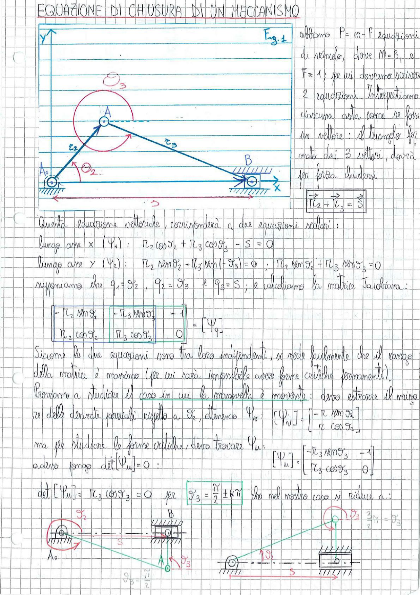

# Page 19 - Equazione di Chiusura di un Meccanismo

## Equazione di chiusura

> 
> Diagramma: Meccanismo a manovella-biella-corsoio (quadrilatero articolato) con asta $r_2$ collegata al telaio in $A_0$, asta $r_3$ collegata al punto $A$ e al corsoio in $B$ che scorre lungo l'asse $x$. Sistema di riferimento con origine in $A_0$, assi $x$ e $y$. Il triangolo formato dai vettori rappresenta l'equazione di chiusura vettoriale.

**Fig. 1**

Abbiamo $P = m - F$ equazioni di vincolo, dove $M = 3$, e $F = 1$; per cui dovremo scrivere 2 equazioni. Interpretiamo ciascuna asta come se fosse un vettore: il triangolo formato dai 3 vettori, dovrà per forza chiudersi.

$$\boxed{\vec{r}_2 + \vec{r}_3 = \vec{S}}$$

Questa equazione vettoriale, corrisponderà a due equazioni scalari:

- lungo asse $x$ ($\Psi_1$): $\quad r_2 \cos\vartheta_2 + r_3 \cos\vartheta_3 - S = 0$

- lungo asse $y$ ($\Psi_2$): $\quad r_2 \sin\vartheta_2 - r_3 \sin(-\vartheta_3) = 0 \quad ; \quad r_2 \sin\vartheta_2 + r_3 \sin\vartheta_3 = 0$

Supponiamo che $q_1 = \vartheta_2$, $q_2 = \vartheta_3$ e $q_3 = S$; e calcoliamo la matrice Jacobiana:

$$\boxed{\begin{bmatrix} -r_2 \sin\vartheta_2 & -r_3 \sin\vartheta_3 & -1 \\ r_2 \cos\vartheta_2 & r_3 \cos\vartheta_3 & 0 \end{bmatrix} = [\Psi_q]}$$

Siccome le due equazioni sono tra loro indipendenti, si vede facilmente che il rango della matrice è massimo (per cui sarà impossibile avere forme critiche permanenti).

Proviamo a studiare il caso in cui la manovella è movente: devo estrarre il minore delle derivate parziali rispetto a $\vartheta_2$, ottenendo $\Psi_{qr}$:

$$[\Psi_{q_r}] = \begin{bmatrix} -r_2 \sin\vartheta_2 \\ r_2 \cos\vartheta_2 \end{bmatrix}$$

ma per studiare le forme critiche, devo trovare $\Psi_u$:

$$[\Psi_u] = \begin{bmatrix} -r_3 \sin\vartheta_3 & -1 \\ r_3 \cos\vartheta_3 & 0 \end{bmatrix}$$

adesso pongo $\det[\Psi_u] = 0$:

$$\det[\Psi_u] = r_3 \cos\vartheta_3 = 0 \quad \text{per} \quad \vartheta_3 = \frac{\pi}{2} \pm k\pi$$

che nel nostro caso si riduce a:

> 
> Diagramma: Tre configurazioni critiche del meccanismo biella-manovella. A sinistra: $\vartheta_3 = \frac{\pi}{2}$, la biella è verticale con il corsoio in posizione intermedia. Al centro: la biella è verticale verso il basso ($\vartheta_3 = \frac{\pi}{2}$). A destra: configurazione con $\vartheta_3 = \frac{3\pi}{2} = \vartheta_3$, corsoio e biella allineati orizzontalmente.
