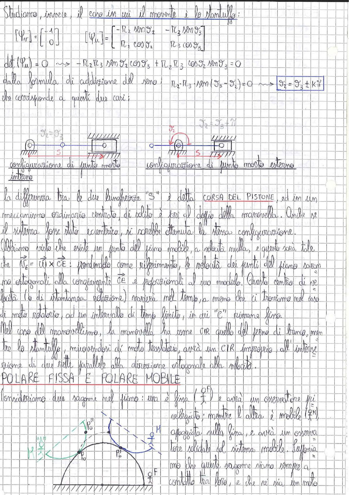

# Page 20 - Manovellismo: Punti Morti e Polare Fissa/Mobile

## Caso in cui il movente è lo stantuffo

Studiamo, invece, il caso in cui il movente è lo stantuffo:

$$[\Psi_n] = \begin{bmatrix} -1 \\ 0 \end{bmatrix} \qquad [\Psi_u] = \begin{bmatrix} -R_2 \sin\vartheta_2 & -R_3 \sin\vartheta_3 \\ R_2 \cos\vartheta_2 & R_3 \cos\vartheta_3 \end{bmatrix}$$

$$\det(\Psi_u) = 0 \quad \Longrightarrow \quad -R_2 R_3 \sin\vartheta_2 \cos\vartheta_3 + R_2 R_3 \cos\vartheta_2 \sin\vartheta_3 = 0$$

Dalla formula di addizione del seno:

$$R_2 \cdot R_3 \cdot \sin(\vartheta_3 - \vartheta_2) = 0 \quad \Longrightarrow \quad \boxed{\vartheta_2 = \vartheta_3 \pm k\pi}$$

Ciò corrisponde a questi due casi:

> 
> Diagramma: Due configurazioni del manovellismo — a sinistra la configurazione di punto morto interno (con $\vartheta_2 = \vartheta_3$, manovella e biella allineate ripiegate), a destra la configurazione di punto morto esterno (con $\vartheta_2 = \vartheta_3 + \pi$, manovella e biella allineate distese)

## Corsa del pistone

La differenza tra le due lunghezze "S" è detta **CORSA DEL PISTONE**, ed in un meccanismo ordinario centrato, di solito è pari al doppio della manovella. Anche se il sistema fosse stato eccentrico, si sarebbe ottenuta la stessa configurazione.

## Centro di istantanea rotazione (CIR)

Abbiamo visto che esiste un punto del piano mobile, a velocità nulla, e questo sarà tale che $\vec{v}_E = \vec{\omega} \times \overline{CE}$: prendendo come riferimento, le velocità dei punti del piano saranno ortogonali alla congiungente $\overline{CE}$ e proporzionali al suo modulo. Questo centro di velocità (o di istantanea rotazione) varierà nel tempo, a meno che ci troviamo nel caso di moto rotatorio, od un intervallo di tempo finito, in cui "C" rimane fisso.

Nel caso del manovellismo, la manovella ha come CIR quello del perno di telaio, mentre lo stantuffo, muovendosi di moto traslatorio, avrà un CIR improprio, all'intersezione di due rette parallele alla direzione ortogonale alla velocità.

## POLARE FISSA E POLARE MOBILE

Consideriamo due sagome nel piano: una è fissa ($\Sigma^F$) e sarà un osservatore fisso relegato; mentre l'altra è mobile ($\Sigma^M$), appoggiata sulla fissa, e avrà un osservatore solidale al sistema mobile. Supponiamo che queste sagome siano sempre a contatto tra loro, e che vi sia un moto

> 
> Diagramma: Rappresentazione delle polari fissa e mobile — si vedono due curve (sagome) a contatto, con punti $P_0$, $P_0'$, $P_0''$ indicanti le successive posizioni del centro di istantanea rotazione, e i sistemi di riferimento fisso (F) e mobile (M) con le rispettive polari che rotolano l'una sull'altra
