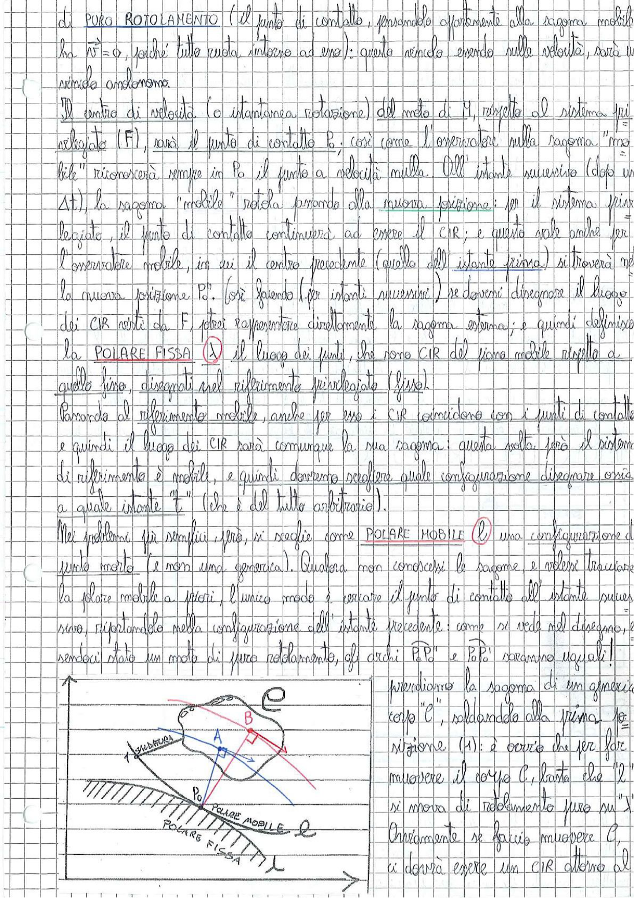

# Page 21 - Polare Fissa e Polare Mobile (Rotolamento Puro)

di **PURO ROTOLAMENTO** (il punto di contatto, pensandolo appartenente alla sagoma mobile, ha $\vec{v} = 0$, poiché tutto ruota intorno ad esso): questo vincolo essendo sulle velocità, sarà un vincolo anolonomo.

Il centro di velocità (o istantanea rotazione) del moto di M, rispetto al sistema privilegiato (F), sarà il punto di contatto P; così come l'osservatore sulla sagoma "mobile" riconoscerà sempre in P₀ il punto a velocità nulla. All'istante successivo (dopo un $\Delta t$) la sagoma "mobile" rotola portando alla nuova posizione: per il sistema privilegiato, il punto di contatto continuerà ad essere il CIR; e questo vale anche per l'osservatore mobile, in cui il centro precedente (quello dell'istante prima) si troverà nella nuova posizione P''. Così facendo (per istanti successivi) se dovessi disegnare il luogo dei CIR visti da F, otterrei rappresentare direttamente la sagoma esterna; e quindi definisco la **POLARE FISSA** $(\lambda)$ il luogo dei punti, che sono CIR del piano mobile rispetto a quello fisso, disegnati nel riferimento privilegiato (fisso).

Passando al riferimento mobile, anche per esso i CIR coincidono con i punti di contatto e quindi il luogo dei CIR sarà comunque la sua sagoma: questa volta però il sistema di riferimento è mobile, e quindi dovremo scegliere quale configurazione disegnare ossia a quale istante "t" (che è del tutto arbitrario).

Nei problemi più semplici, però, si sceglie come **POLARE MOBILE** $(\ell)$ una configurazione di punto morto (e non una generica). Qualora non conoscessimo le sagome, e volessimo tracciare la polare mobile a priori, l'unico modo è cercare il punto di contatto all'istante successivo, riportandolo nella configurazione dell'istante precedente: come si vede nel disegno, essendoci stato un moto di puro rotolamento, gli archi $\widehat{PP''}$ e $\widehat{P_0P''}$ saranno uguali!

Prendiamo la sagoma di un generico corpo "C", solidando alla prima posizione ($\lambda$): è ovvio che per far muovere il corpo C, basta che "$\ell$" si muova di rotolamento puro su "$\lambda$". Chiaramente se faccio muovere C, ci dovrà essere un CIR attorno al...

> 
> Diagramma: Schema che mostra un corpo generico C con sagoma irregolare, con indicati i punti A e B, la polare mobile (ℓ) solidale al corpo e la polare fissa (λ) tracciata sul piano fisso. Si vede il punto P₀ sulla polare mobile e il punto di contatto tra le due polari. La superficie fissa è tratteggiata e sono indicati gli assi di riferimento x e y.
