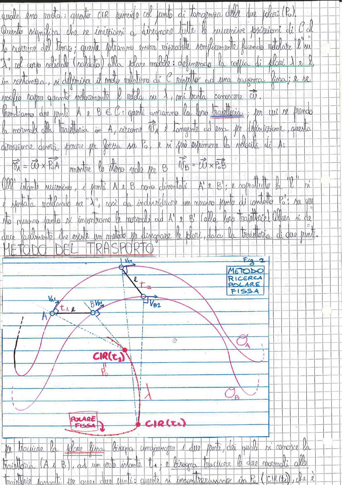

# Page 22 - Metodo del Trasporto e Polare Fissa

quale era ruota; questo CIR coincide col punto di tangenza delle due polari ($P_0$).

Questo significa che se iniziassimo a disegnare tutte le successive posizioni di C al lo scorrere del tempo; queste potranno essere riprodotte semplicemente facendo rotolare la "$\ell$" su "$\lambda$", il corpo solidale (saldato) alla polare mobile: delineando la coppia di polari $\lambda$ e $\ell$ in rotolanza, si definisce il moto relativo di C rispetto ad una sagoma fissa; e se voglio sapere quanto velocemente la ruota su $\lambda$, mi basta conoscere $\vec{\omega}$.

Prendiamo due punti A e B $\in$ C: questi avranno la loro **traiettoria**; per cui se prendo la normale alla traiettoria in A, siccome $\vec{v}_A$ è tangente ad essa per definizione, questa direzione dovrà passare per forza su $P_0$, e si può esprimere la velocità di A:

$$\boxed{\vec{v}_A = \vec{\omega} \times \overrightarrow{P_0 A}} \quad \text{mentre lo stesso vale per B} \quad \vec{v}_B = \vec{\omega} \times \overrightarrow{P_0 B}$$

All'istante successivo, i punti A e B sono diventati A' e B'; e soprattutto la "$\ell$" si è spostata rotolando su "$\lambda$", così da individuare un nuovo punto di contatto $P_0'$: su questo nuovo punto si incontrano le normali ad A' e B' (alle loro traiettorie). Allora si capisce facilmente che esiste un metodo per disegnare le polari, data la traiettoria di due punti.

## METODO DEL TRASPORTO

> 
> Diagramma: Figura 2 - Metodo di ricerca della polare fissa. Si mostrano due punti A e B con le rispettive velocità $V_{A1}$, $V_{A2}$, $V_{B1}$, $V_{B2}$ agli istanti $t_1$ e $t_2$. Le normali alle traiettorie si incontrano nei rispettivi CIR: $CIR(t_1)$ in basso e $CIR(t_2)$ al centro. La curva $\lambda$ (polare fissa) è tracciata congiungendo i CIR successivi. Sono indicate anche le traiettorie circolari $\mathcal{O}_A$ e $\mathcal{O}_B$ dei due punti, e il corpo $\ell$ (polare mobile).

Per tracciare la polare fissa bisogna congiungere i due punti, dei quali si conosce la traiettoria (A e B), ad un certo istante $t_1$; e bisogna tracciare le due normali alle traiettorie passanti per quei due punti: queste si incontreranno in $P_0$ ($CIR(t_1)$), che è
