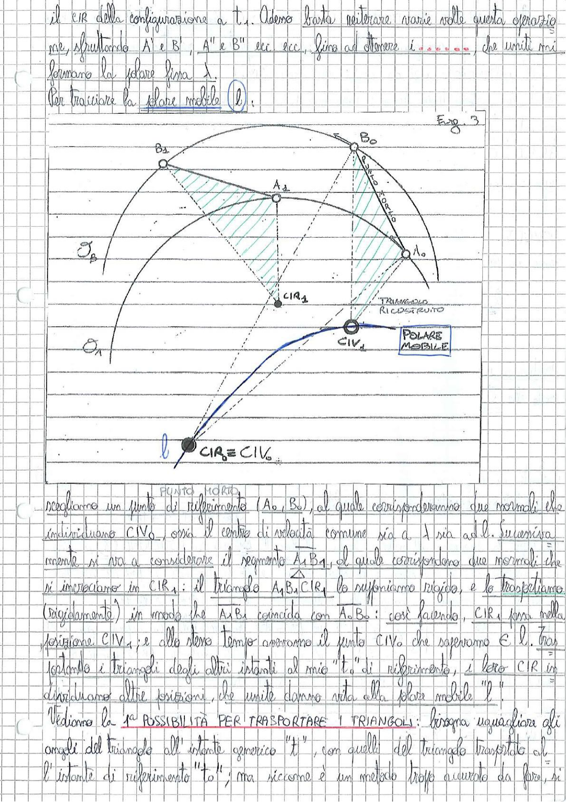

# Page 23 - Polare Mobile e Metodo del Trasporto dei Triangoli

il CIR della configurazione a $t_1$. Adesso basta reiterare varie volte questa operazione, sfruttando A' e B', A'' e B'' ecc ecc, fino ad ottenere i **......**, che uniti mi formano la polare fissa $\lambda$.

Per tracciare la **polare mobile** ($\ell$):

> 
> Diagramma: Figura 3 - Costruzione della polare mobile. Si mostrano i punti $A_0$, $B_0$ (punto morto) e $A_1$, $B_1$ con le rispettive normali alle traiettorie. Le normali di $A_0$ e $B_0$ si incontrano in $CIR_0 \equiv CIV_0$ (in basso). Le normali di $A_1$ e $B_1$ si incontrano in $CIR_1$. Il triangolo $A_1 B_1 CIR_1$ viene trasportato rigidamente facendo coincidere $A_1 B_1$ con $A_0 B_0$, ottenendo la posizione $CIV_1$ (polare mobile). Le traiettorie circolari $\mathcal{O}_A$ e $\mathcal{O}_B$ sono indicate con archi di cerchio. Il "triangolo ricostruito" è evidenziato.

## Costruzione della polare mobile

Scegliamo un punto di riferimento ($A_0$, $B_0$), al quale corrisponderanno due normali che individuano $CIV_0$, ossia il centro di velocità comune sia a $\lambda$ sia ad $\ell$. Successivamente, si va a considerare il segmento $A_1 B_1$, al quale corrispondono due normali che si incrociano in $CIR_1$: il triangolo $A_1 B_1 CIR_1$ lo supponiamo rigido, e lo **trasportiamo** (rigidamente) in modo che $A_1 B_1$ coincida con $A_0 B_0$: così facendo, $CIR_1$ sarà nella posizione $CIV_1$; e allo stesso tempo avremo il punto $CIV_0$ che sapevamo è $\ell$. Trasportando i triangoli degli altri istanti al mio "$t$" di riferimento, i loro $CIR$ individuano altre posizioni, che unite danno vita alla polare mobile "$\ell$"!

## 1ª Possibilità per trasportare i triangoli

Vediamo la 1ª POSSIBILITÀ PER TRASPORTARE I TRIANGOLI: bisogna uguagliare gli angoli del triangolo all'istante generico "$t$", con quelli del triangolo trasportato all'istante di riferimento "$t_0$"; ma siccome è un metodo troppo accurato da fare, si
