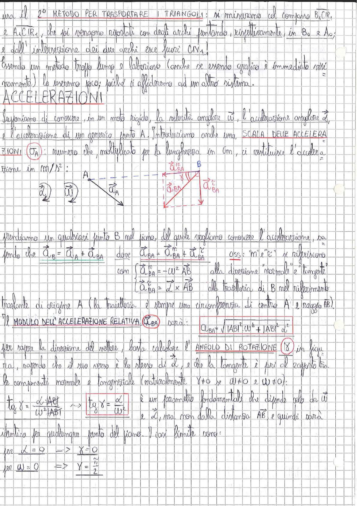

# Page 24 - Accelerazioni

## Metodo per trasportare i triangoli (conclusione)

...ma il 2° **METODO PER TRASPORTARE I TRIANGOLI**: si misurano col compasso $B_4 C_1 R_1$ e $A_1 C_1 R_1$, che poi vengono riportati con degli archi puntando, rispettivamente, in $B_0$ e $A_0$; e dall'intersezione dei due archi esce fuori $C_1 N_1$!

Essendo un metodo troppo lungo e laborioso (anche se essendo grafico è immediato visivamente) lo useremo poco; piuttosto ci affideremo ad un altro sistema.

---

## ACCELERAZIONI

Supponiamo di conoscere, in un moto rigido, la velocità angolare $\vec{\omega}$, l'accelerazione angolare $\vec{\alpha}$, e l'accelerazione di un generico punto A. Introduciamo anche una **SCALA DELLE ACCELERAZIONI** $\sigma_A$: numero che, moltiplicato per la lunghezza in cm, ci restituisce l'accelerazione in $m/s^2$:

> 
> Diagramma: schema vettoriale dell'accelerazione del punto B rispetto ad A, con le componenti normale ($\vec{a}_{BA}^n$) e tangenziale ($\vec{a}_{BA}^t$) dell'accelerazione relativa, angolo $\gamma$ tra le componenti, e il vettore $\vec{a}_A$ nel punto A.

Prendiamo un qualsiasi punto B nel piano, del quale vogliamo conoscere l'accelerazione, sapendo che:

$$\vec{a}_B = \vec{a}_A + \vec{a}_{BA} \quad \text{dove} \quad \vec{a}_{BA} = \vec{a}_{BA}^n + \vec{a}_{BA}^t$$

Oss: "n" e "t" si riferiscono alla direzione "normale" e "tangente" alla traiettoria di B nel riferimento traslante di origine A (la traiettoria è sempre una circonferenza di centro A e raggio AB).

Con:

$$\begin{cases} \vec{a}_{BA}^n = -\omega^2 \vec{AB} \\ \vec{a}_{BA}^t = \vec{\alpha} \times \vec{AB} \end{cases}$$

Il **MODULO DELL'ACCELERAZIONE RELATIVA** $(\vec{a}_{BA})$ sarà:

$$\boxed{a_{BA} = \sqrt{|AB|^2 \omega^4 + |AB|^2 \alpha^2}}$$

Per sapere la direzione del vettore, basta calcolare l'**ANGOLO DI ROTAZIONE** ($\gamma$), in figura, sapendo che il suo verso è lo stesso di $\vec{\alpha}$, e che la tangente è pari al rapporto tra la componente normale e tangenziale (naturalmente $\gamma \neq 0$ se $\omega \neq 0$ e $\omega \neq 0$):

$$tg\ \gamma = \frac{\alpha \cdot |AB|}{\omega^2 \cdot |AB|} \implies \boxed{tg\ \gamma = \frac{\alpha}{\omega^2}}$$

è un parametro fondamentale che dipende solo da $\vec{\omega}$ e $\vec{\alpha}$, ma non dalla distanza AB, e quindi sarà identico per qualunque punto del piano. I casi limite sono:

$$\text{per } \alpha = 0 \implies \gamma = 0$$

$$\text{per } \omega = 0 \implies \gamma = \frac{\pi}{2}$$
