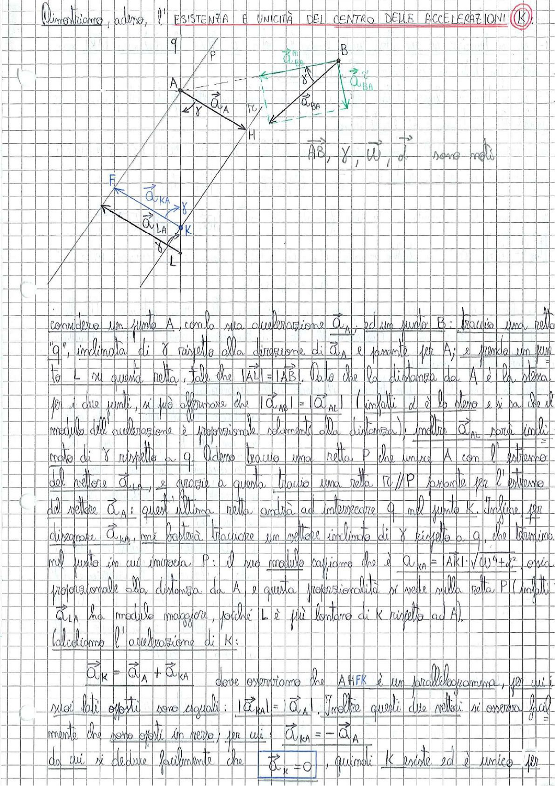

# Page 25 - Esistenza e Unicità del Centro delle Accelerazioni (K)

Dimostriamo, adesso, l'**ESISTENZA E UNICITÀ DEL CENTRO DELLE ACCELERAZIONI (K)**.

> 
> Diagramma: Costruzione geometrica del centro delle accelerazioni K. Si vedono i punti A e B con i rispettivi vettori accelerazione $\vec{a}_A$ e $\vec{a}_B$, la retta q inclinata di $\gamma$ rispetto alla direzione di $\vec{a}_A$, i punti L, K, H, F, P e le rette di costruzione. Sono noti: $\vec{AB}$, $\gamma$, $\vec{\omega}$, $\dot{\vec{\omega}}$.

---

Considero un punto A, con la sua accelerazione $\vec{a}_A$; ed un punto B: traccio una retta "q", inclinata di $\gamma$ rispetto alla direzione di $\vec{a}_A$ e passante per A; e prendo un punto L su questa retta, tale che $|\vec{AL}| = |\vec{AB}|$. Dato che la distanza da A è la stessa per i due punti, si può affermare che $|\vec{a}_{AB}| = |\vec{a}_{AL}|$ (infatti $\omega$ è lo stesso e si sa che il modulo dell'accelerazione è proporzionale solamente alla distanza); inoltre $\vec{a}_{AL}$ sarà inclinata di $\gamma$ rispetto a q. Adesso traccio una retta P che unisce A con l'estremo del vettore $\vec{a}_{LA}$, e grazie a questa traccio una retta R // P passante per l'estremo del vettore $\vec{a}_B$: quest'ultima retta andrà ad intersecare q nel punto K. Infine, per disegnare $\vec{a}_{KA}$, mi basterà tracciare un vettore inclinato di $\gamma$ rispetto a q, che termina nel punto in cui incrocia P: il suo modulo sappiamo che è $\vec{a}_{KA} = |AK| \cdot \sqrt{\omega^4 + \dot{\omega}^2}$, ossia proporzionale alla distanza da A, e questa proporzionalità si vede sulla retta P (infatti $\vec{a}_{LA}$ ha modulo maggiore, poiché L è più lontano di K rispetto ad A).

Calcoliamo l'accelerazione di K:

$$\vec{a}_K = \vec{a}_A + \vec{a}_{KA}$$

dove osserviamo che AHFK è un parallelogramma, per cui i suoi lati opposti sono uguali: $|\vec{a}_{KA}| = |\vec{a}_A|$. Inoltre questi due vettori si osserva facilmente che sono opposti in verso; per cui: $\vec{a}_{KA} = -\vec{a}_A$

da cui si deduce facilmente che:

$$\boxed{\vec{a}_K = 0}$$

, quindi **K esiste ed è unico** per
