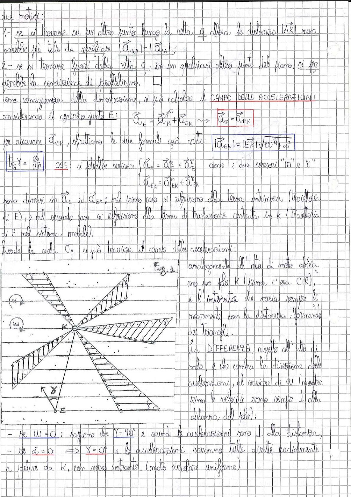

# Page 26 - Campo delle accelerazioni

due motivi:

1 - se si trovasse su un altro punto lungo la retta $q$, allora la distanza $|\overline{AK}|$ non sarebbe più tale da verificare $|\vec{a}_{KA}| = |\vec{a}_{A}|$;

2 - se si trovasse fuori dalla retta $q$, in un qualsiasi altro punto del piano, si perderebbe la condizione di parallelismo. $\square$

Come conseguenza della dimostrazione, si può calcolare il **CAMPO DELLE ACCELERAZIONI** considerando il generico punto E:

$$\vec{a}_E = \vec{a}_K + \vec{a}_{EK} \quad \sim> \quad \boxed{\vec{a}_E = \vec{a}_{EK}}$$

per ricavare $\vec{a}_{EK}$, sfruttiamo le due formule già viste:

$$\boxed{|\vec{a}_{EK}| = |EK| \sqrt{\omega^4 + \dot{\alpha}^2}}$$

$$\boxed{\tan \gamma = \frac{\dot{\alpha}}{\omega^2}}$$

**OSS:** si potrebbe scrivere $\begin{cases} \vec{a}_E = \vec{a}_E^n + \vec{a}_E^t \\ \vec{a}_{EK} = \vec{a}_{EK}^n + \vec{a}_{EK}^t \end{cases}$ dove i due versori "$\hat{n}$" e "$\hat{t}$"

sono diversi in $\vec{a}_E$ ed $\vec{a}_{EK}$; nel primo caso si riferiscono alla terna intrinseca (traiettoria di E), e nel secondo caso si riferiscono alla terna di traslazione centrata in K (traiettoria di E nel sistema mobile).

Fissata la scala $\eta_a$, si può tracciare il campo delle accelerazioni:

> 
> Diagramma: Campo delle accelerazioni con polo K. Rappresentazione grafica dei vettori accelerazione che partono radialmente da K con angolo γ rispetto alla direzione radiale, formando triangoli. Si mostrano i casi con ω e α, evidenziando come l'intensità varia linearmente con la distanza da K. Fig. 2.

Analogamente all'atto di moto abbiamo un *polo* K (prima c'era CIR), e l'intensità che varia sempre linearmente con la distanza, formando dei triangoli.

La **DIFFERENZA**, rispetto all'atto di moto, è che cambia la direzione delle accelerazioni, al variare di $\omega$ (mentre prima le velocità erano sempre $\perp$ alla distanza dal polo);

- se $\omega = 0$: sappiamo che $\gamma = 90°$ e quindi le accelerazioni sono $\perp$ alla distanza,
- se $\dot{\alpha} = 0$ $\Rightarrow$ $\gamma = 0°$ e le accelerazioni saranno tutte dirette radialmente a partire da K, con verso entrante (moto circolare uniforme)
