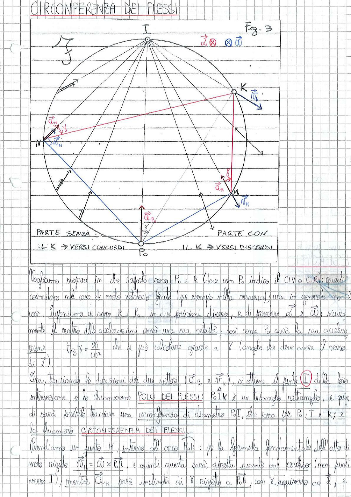

# Page 27 - Circonferenza dei Flessi

## CIRCONFERENZA DEI FLESSI

> 
> Diagramma: Circonferenza dei flessi (Fig. 3) con polo $P_0$ in basso, punto $K$ (centro delle accelerazioni) a destra, punto $I$ (polo dei flessi) in alto, e punto generico $M$. Sono indicati i vettori accelerazione $\vec{a}_{P_0}$, $\vec{a}_M$, le velocità $\vec{v}_K$, $\vec{v}_N$, $\vec{v}_H$. I vettori $\vec{\dot{\alpha}}$ e $\vec{\omega}$ sono entranti nel piano (simbolo $\otimes$). La parte sinistra è indicata come "PARTE SENZA IL K → VERSI CONCORDI", la parte destra come "PARTE CON IL K → VERSI DISCORDI".

---

Vogliamo capire in che rapporto sono $P_0$ e $K$ (dove con $P_0$ indico il CIV o CIR): questi coincidono nel caso di moto rotatorio finito (per esempio nella cerniera); ma in generale non è così. Supponiamo di avere $K$ e $P_0$ in due posizioni diverse, e di fissare $\vec{\dot{\alpha}}$ e $\vec{\omega}$; sicuramente il centro delle accelerazioni avrà una sua velocità; così come $P_0$ avrà la sua accelerazione.

$$\boxed{tg\, \gamma = \frac{\dot{\alpha}}{\omega^2}}$$

che si può calcolare grazie a $\gamma$ (angolo che deve avere il verso di $\vec{\dot{\alpha}}$).

Ora, tracciando le direzioni dei due vettori ($\vec{a}_{P_0}$ e $\vec{v}_K$), si ottiene il punto $\textcircled{I}$ dalla loro intersezione, e lo chiameremo **POLO DEI FLESSI**: $P_0 I K$ è un triangolo rettangolo, e quindi sarà possibile tracciare una circonferenza di diametro $P_0 I$, che passa per $P_0$, $I$ e $K$; e la chiameremo **CIRCONFERENZA DEI FLESSI**.

Prendiamo un punto $M$, interno all'arco $P_0 K$: per la formula fondamentale dell'atto di moto rigido $\vec{v}_M = \vec{\omega} \times \overline{P_0 M}$ e quindi questa sarà diretta uscente dal cerchio (non punta verso $I$); mentre $\vec{a}_M$ sarà inclinata di $\gamma$ rispetto a $\overline{P_0 M}$, con $\gamma$ equivalente ad $\vec{\dot{\alpha}}$, e
