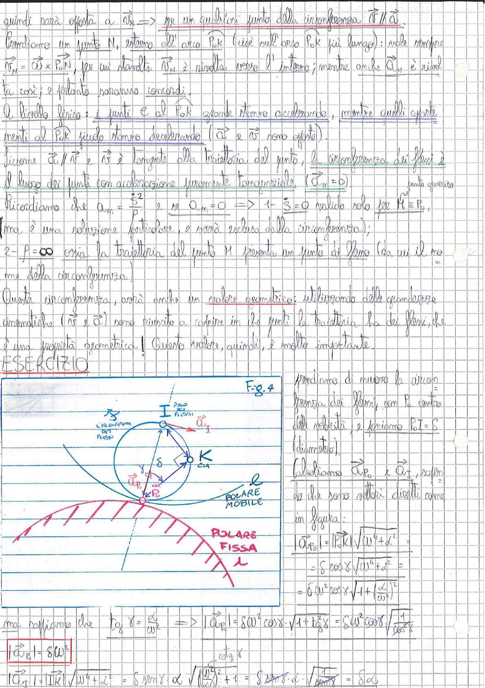

# Page 28 - Circonferenza dei flessi e esercizio

quindi sarà opposta a $\vec{a}_N$ $\Rightarrow$ per un qualsiasi punto della circonferenza $\vec{v} \parallel \vec{a}$.

Prendiamo un punto N, esterno all'arco $P_0K$ (cioè sull'arco $P_0K$ più lungo): vale sempre $\vec{v}_N = \vec{\omega} \times \overrightarrow{P_0 N}$, per cui stavolta $\vec{v}_N$ è rivolta verso l'interno; mentre anche $\vec{a}_N$ è rivolta così; e pertanto saranno concordi.

A livello fisico: i punti $\in$ al $P_0K$ grande stanno accelerando, mentre quelli opposti menti al $P_0K$ piccolo stanno decelerando ($\vec{a}$ e $\vec{v}$ sono opposte).

Siccome $\vec{a} \parallel \vec{v}$ e $\vec{v}$ è tangente alla traiettoria del punto, la **circonferenza dei flessi** è il luogo dei punti con accelerazione puramente tangenziale ($\vec{a}_N = 0$).

Ricordiamo che $a_N = \frac{\dot{s}^2}{\rho}$ e se $a_N = 0$ $\Rightarrow$ $\dot{s} = 0$ valido solo per $M \equiv P_0$, *punto generico* ma è una soluzione particolare, e sarà esclusa dalla circonferenza);

$2 - \rho = \infty$ ossia la traiettoria del punto M presenta un punto di flesso (da cui il nome della circonferenza).

Questa circonferenza, avrà anche un valore geometrico: utilizzando delle grandezze cinematiche ($\vec{v}$ e $\vec{a}$) sono riuscito a capire in quali punti la traiettoria ha dei flessi, che è una **proprietà geometrica**! Questo valore, quindi, è molto importante.

---

## ESERCIZIO

> 
> Diagramma: Figura 4 - Circonferenza dei flessi con punto I (polo dei flessi) in alto, punto $P_0$ (centro delle velocità) in basso a sinistra, punto K (CIA) a destra. È indicata la polare mobile (cerchio) e la polare fissa (linea con cuspidi). Sono rappresentati i vettori $\vec{a}_I$ e $\vec{a}_{P_0}$, con l'angolo $\gamma$ e la distanza $\delta$.

Prendiamo di muovere la circonferenza dei flessi, con $P_0$ centro delle velocità, e poniamo $P_0 I = \delta$ (diametro).

Calcoliamo $a_{P_0}$ e $a_I$, sapendo che sono vettori diretti come in figura:

$$|\vec{a}_{P_0}| = |\overline{P_0 K}| \sqrt{\omega^4 + \alpha^2} =$$

$$= \delta \cos\gamma \sqrt{\omega^4 + \alpha^2} =$$

$$= \delta \omega^2 \cos\gamma \sqrt{1 + \left(\frac{\alpha}{\omega^2}\right)^2}$$

ma sappiamo che $\tan\gamma = \frac{\alpha}{\omega^2}$ $\Rightarrow$ $|\vec{a}_{P_0}| = \delta\omega^2 \cos\gamma \cdot \sqrt{1 + \tan^2\gamma} = \delta\omega^2 \cos\gamma \sqrt{\frac{1}{\cos^2\gamma}}$

$$\boxed{|\vec{a}_{P_0}| = \delta\omega^2}$$

$$|\vec{a}_I| = |\overline{IK}| \sqrt{\omega^4 + \alpha^2} = \delta \sin\gamma \cdot \alpha \sqrt{\left(\frac{\omega^2}{\alpha}\right)^2 + 1} = \delta \cdot \frac{\sin\gamma}{\sin\gamma} \cdot \alpha \cdot \sqrt{\frac{1}{\sin^2\gamma}} = \delta\alpha$$
