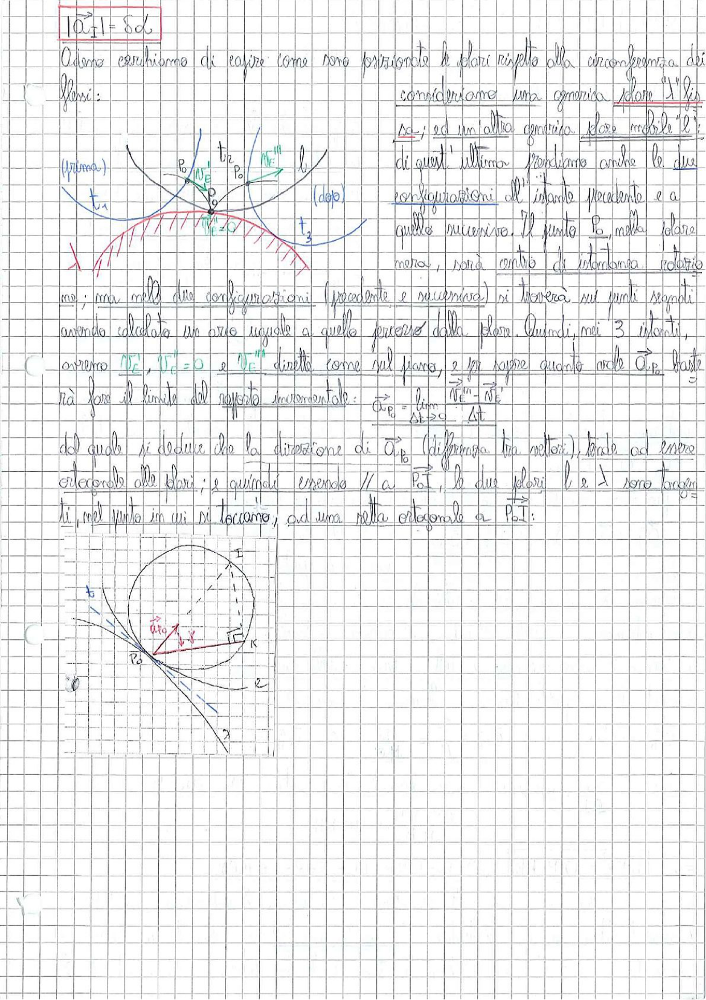

# Page 29 - Posizione delle polari rispetto alla circonferenza dei flessi

$$\boxed{|\vec{a}_I| = \delta \alpha}$$

Adesso cerchiamo di capire come sono posizionate le polari rispetto alla circonferenza dei flessi:

consideriamo una generica polare $\lambda$ fissa $\Delta_f$; ed un altro generico polare mobile $\ell_2$: di quest'ultimo prendiamo anche le due configurazioni all'istante precedente e a quello successivo.

> 
> Diagramma: Due polari (fissa e mobile) tangenti nel punto $P_0$ con la circonferenza dei flessi. Sono mostrate le configurazioni della polare mobile agli istanti $t_1$ (prima), $t_2$ e $t_3$ (dopo), con i vettori $\vec{v}_E$ e $\vec{v}_{E'}$. La polare fissa è rappresentata con linea concava verso l'alto (blu), la mobile con archi (rosso) nelle tre posizioni temporali.

Il punto $P_0$ nella polare mossa, sarà centro di istantanea rotazione; ma nelle altre configurazioni (precedente e successiva) si troverà sui punti segnati avendo calcolato un arco uguale a quello percorso dalla polare. Quindi, nei 3 istanti, avremo $\vec{v}_E^{''}$, $\vec{v}_E^{'} = 0$ e $\vec{v}_{E'}^{''}$ dirette come sul piano, e per sapere quanto vale $\vec{a}_{P_0}$ basterà fare il limite del rapporto incrementale:

$$\vec{a}_{P_0} = \lim_{\Delta t \to 0} \frac{\vec{v}_E^{''} - \vec{v}_E'}{\Delta t}$$

dal quale si deduce che la direzione di $\vec{a}_{P_0}$ (differenza tra vettori), tende ad essere ortogonale alle polari; e quindi essendo $\parallel$ a $\overrightarrow{P_0 I}$, le due polari $\ell$ e $\lambda$ sono tangenti, nel punto in cui si toccano, ad una retta ortogonale a $\overrightarrow{P_0 I}$:

> 
> Diagramma: Costruzione geometrica con un cerchio (circonferenza dei flessi) con centro e punti $P_0$, $K$, $I$ indicati. Il vettore $\vec{a}_{P_0}$ è rappresentato in rosso. Si vedono le tangenti alle polari e la retta ortogonale a $\overrightarrow{P_0 I}$. La curva esterna al cerchio rappresenta la polare fissa con punto di tangenza, e si vede la relazione geometrica tra la direzione dell'accelerazione e la posizione delle polari.
