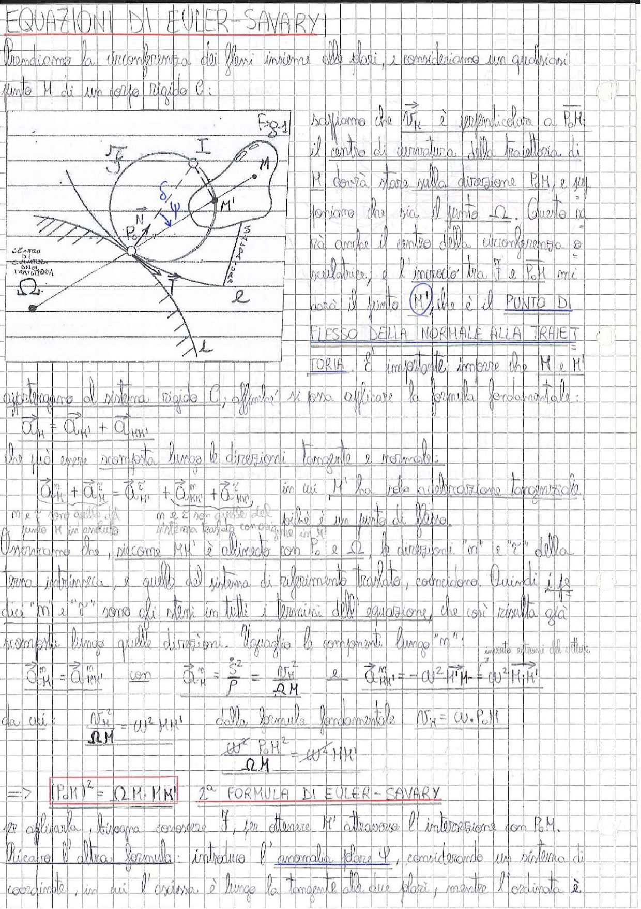

# Page 30 - Equazioni di Euler-Savary

## EQUAZIONI DI EULER-SAVARY

Prendiamo la circonferenza dei flessi insieme alle polari, e consideriamo un qualsiasi punto M di un corpo rigido C:

> 
> Diagramma: Figura 8.1 - Circonferenza dei flessi con punto $P_0$ (centro delle velocità), punto M sulla polare mobile, punto M' (punto di flesso della normale alla traiettoria), punto I (polo dei flessi), punto N, e le tangenti $\vec{\tau}$ alla traiettoria. Sono indicati gli angoli $\delta$, $\psi$, la polare fissa e la polare mobile (cerchio). Sono visibili anche $\Omega$ (centro di curvatura della traiettoria) e la retta $\ell$.

Sappiamo che $\vec{a}_N$ è perpendicolare a $\overrightarrow{P_0 M}$: il centro di curvatura della traiettoria di M dovrà stare sulla direzione $P_0 M$, e qui troviamo che sia il punto $\Omega$. Questo si troverà anche il centro della circonferenza osculatrice, e l'incrocio tra $\vec{\tau}$ e $P_0 M$ mi darà il punto $\boxed{M'}$, che è il **PUNTO DI FLESSO DELLA NORMALE ALLA TRAIETTORIA**.

È importante intendere che M e M' appartengono al sistema rigido C, affinché si possa applicare la formula fondamentale:

$$\vec{a}_M = \vec{a}_{M'} + \vec{a}_{MM'}$$

che può essere scomposta lungo le direzioni tangente e normale:

$$\vec{a}_M^m + \vec{a}_M^n = \vec{a}_{M'}^m + \vec{a}_{M'}^n + \vec{a}_{MM'}^m + \vec{a}_{MM'}^n$$

in cui M' ha solo accelerazione tangenziale (M e $\tau$ sono quelle di m e $\tau$ sono quelle del sistema traslato con $P_0$), poiché è un punto di flesso. Il punto M è in moto su un interno traslato con $P_0$, che in su.

Osserviamo che, siccome $MM'$ è allineato con $P_0$ e $\Omega$, le direzioni "m" e "$\tau$" della terna intrinseca, e quelle del sistema di riferimento traslato, coincidono. Quindi i due "m" e "n" sono gli stessi in tutti i termini dell'equazione, che così risulta già scomposta lungo quelle direzioni. Uguaglio le componenti lungo "n":

$$\vec{a}_M^n = \vec{a}_{MM'}^n \quad \text{con} \quad \vec{a}_M^n = \frac{\dot{s}^2}{P} = \frac{v_M^2}{\overline{\Omega M}} \quad \text{e} \quad \vec{a}_{MM'}^n = -\omega^2 \overline{M'M} = \omega^2 \overline{M_1 M'}$$

da cui: $\quad \dfrac{v_M^2}{\Omega M} = \omega^2 \cdot MM' \quad$ dalla formula fondamentale $\quad v_M = \omega \cdot P_0 M$

$$\frac{\omega^2 \cdot P_0 M^2}{\Omega M} = \omega^2 \cdot MM'$$

$$\boxed{(P_0 M)^2 = \Omega M \cdot MM'} \quad \text{2}^a \text{ FORMULA DI EULER-SAVARY}$$

Per applicarla, bisogna conoscere $\vec{\tau}$, per ottenere M' attraverso l'intersezione con $P_0 M$. Ricaviamo l'altra formula: introduco l'anomalia polare $\psi$, considerando un sistema di coordinate, in cui l'ascissa è lungo la tangente alle due polari, mentre l'ordinata è
