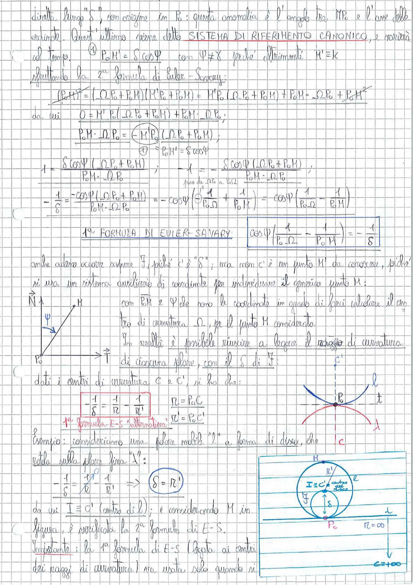

# Page 31 - Prima Formula di Euler-Savary

diretta lungo "$\delta$", con origine in $P_o$: questa anomalia è l'angolo tra $MP_o$ e l'asse delle ordinate. Quest'ultimo viene detto **SISTEMA DI RIFERIMENTO CANONICO**, e ruoterà al tempo.

$$\textcircled{1} \quad P_o M' = S \cos\Psi \quad \text{con } \Psi \neq \chi \quad \text{perché altrimenti} \quad M' \equiv K$$

Sfruttando la 2ª formula di Euler-Savary:

$$\overline{(P_o M')^2} = (\underline{\Omega P_o} + \overline{P_o M})(\overline{M'P_o} + \overline{P_o M}) = M'P_o(\underline{\Omega P_o} + \overline{P_o M}) + P_o M \cdot \underline{\Omega P_o} + \overline{P_o M}^2$$

da cui $\quad 0 = M'P_o(\underline{\Omega P_o} + \overline{P_o M}) + P_o M \cdot \underline{\Omega P_o}$;

$$P_o M \cdot \underline{\Omega P_o} = \underbrace{(-M'P_o)}_{\textcircled{1} = P_o M' = S\cos\Psi} (\underline{\Omega P_o} + \overline{P_o M});$$

$$1 = \frac{S\cos\Psi \, (\underline{\Omega P_o} + \overline{P_o M})}{P_o M \cdot \underline{\Omega P_o}} \; ; \quad -1 = -\frac{S\cos\Psi \, (\underline{\Omega P_o} + \overline{P_o M})}{P_o M \cdot \underline{\Omega P_o}} \; ;$$

$$-\frac{1}{S} = \frac{-\cos\Psi(\underline{\Omega P_o} + \overline{P_o M})}{P_o M \cdot \underline{\Omega P_o}} = -\cos\Psi\left(\frac{1}{P_o\Omega} + \frac{1}{P_o M}\right) = -\cos\Psi\left(\frac{1}{P_o\Omega} - \frac{1}{P_o M}\right)$$

---

$$\boxed{1^a \text{ FORMULA DI EULER-SAVARY} \qquad \cos\Psi\left(\frac{1}{P_o\Omega} - \frac{1}{P_o M}\right) = -\frac{1}{S}}$$

---

Anche adesso occorre sapere $\vec{T}$, poiché c'è "$\delta$"; ma non c'è un punto M' da conoscere, poiché si usa un sistema ausiliario di coordinate per individuare il generico punto M:

> 
> Diagramma: Sistema di riferimento canonico con assi $\vec{N}$ (verticale) e $\vec{T}$ (orizzontale), origine in $P_o$, angolo $\Psi$ che individua la direzione del punto M rispetto all'asse $\vec{N}$.

con $\overline{P_o M}$ e $\Psi$ che sono le coordinate in grado di farci calcolare il centro di curvatura $\Omega$, per il punto M considerato.

In realtà è possibile riuscire a legare il raggio di curvatura di ciascuna polare, con il $S$ di $\vec{T}$:

dati i centri di curvatura C e C', si ha che:

$$\boxed{-\frac{1}{S} = \frac{1}{R} - \frac{1}{R'}} \qquad \begin{aligned} R &= P_o C \\ R' &= P_o C' \end{aligned}$$

**1ª formula E-S "alternativa"**

> 
> Diagramma: Rappresentazione geometrica delle polari (mobile $l$ e fissa $t$) tangenti nel punto $P_o$, con i rispettivi centri di curvatura C e C'. La polare fissa (cerchio inferiore) ha centro C, la polare mobile (cerchio superiore) ha centro C'.

---

## Esempio

Esempio: consideriamo una polare mobile "$l$" a forma di disco, che rotola sulla polare fissa "$t$":

$$-\frac{1}{S} = \frac{1}{R} - \frac{1}{R'} \quad \Rightarrow \quad \boxed{S = R'}$$

da cui $I \equiv C'$ (centro di $l$); e considerando M in figura, è verificata la 2ª formula di E-S.

Importante: la 1ª formula di E-S (legata ai centri dei raggi di curvatura) va usata solo quando si

> 
> Diagramma: Disco (polare mobile $l$) di raggio $R'$ che rotola sulla polare fissa $t$ (linea retta, $R = \infty$). Il centro del disco coincide con $I = C'$ (centro delle accelerazioni). Sono indicati il punto M sulla circonferenza, il punto $P_o$ di contatto, e il diametro $S$ del cerchio dei flessi.
