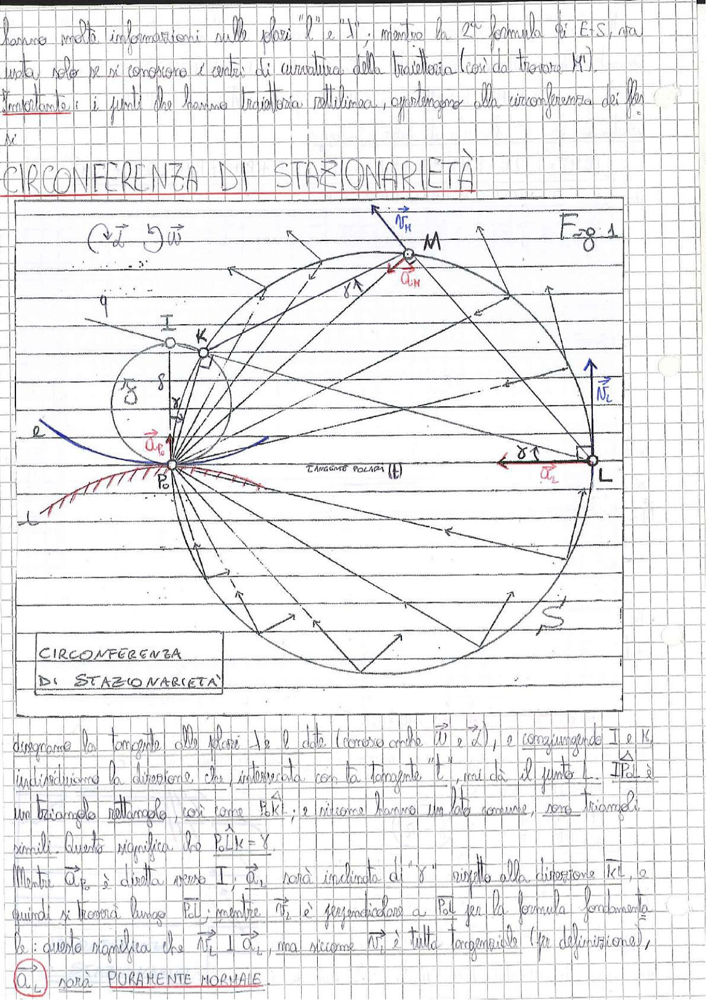

# Page 32 - Circonferenza di Stazionarietà

hanno molte informazioni sulle fasi "l" e "N", mentre la 2ª formula di E.S. sta usata solo se si conoscono i centri di curvatura della traiettoria (così da trovare $M$).

Importante: i punti che hanno traiettoria rettilinea, appartengono alla circonferenza dei flessi.

---

## CIRCONFERENZA DI STAZIONARIETÀ

> 
> Diagramma: Costruzione geometrica della circonferenza di stazionarietà. Si vedono i punti $P_0$, $I$, $K$, $M$, $L$, $S$ con le relative accelerazioni $\vec{a}_{P_0}$, $\vec{a}_M$, $\vec{a}_L$, le normali $\vec{N}_M$, $\vec{N}_L$, la tangente polare (t), il cerchio dei flessi $\delta$ e la circonferenza di stazionarietà. Gli angoli $\gamma$, $\delta$ e le direzioni caratteristiche sono indicati. Fig. 1.

---

Disegniamo la tangente alle polari $1$ e $2$ (che danno anche $\vec{U}$ e $\vec{Z}$), e congiungendo $I$ e $K$ individuiamo la direzione che, intersecata con la tangente "t", mi dà il punto $L$. $\widehat{IP_0L}$ è un triangolo rettangolo, così come $P_0KI$; e siccome hanno un lato comune, sono triangoli simili. Questo significa che $\widehat{P_0LK} = \delta$.

Mentre $\vec{a}_{P_0}$ è diretta verso $I$, $\vec{a}_L$ sarà inclinata di "$\delta$" rispetto alla direzione $\overline{IK}$, e quindi si troverà lungo $P_0L$; mentre $\vec{N}_L$ è perpendicolare a $P_0L$ per la formula fondamentale: questo significa che $\vec{N}_L \perp \vec{a}_L$, ma siccome $\vec{N}$ è tutta tangenziale (per definizione),

$$\boxed{\vec{a}_L \text{ sarà PURAMENTE NORMALE}}$$
