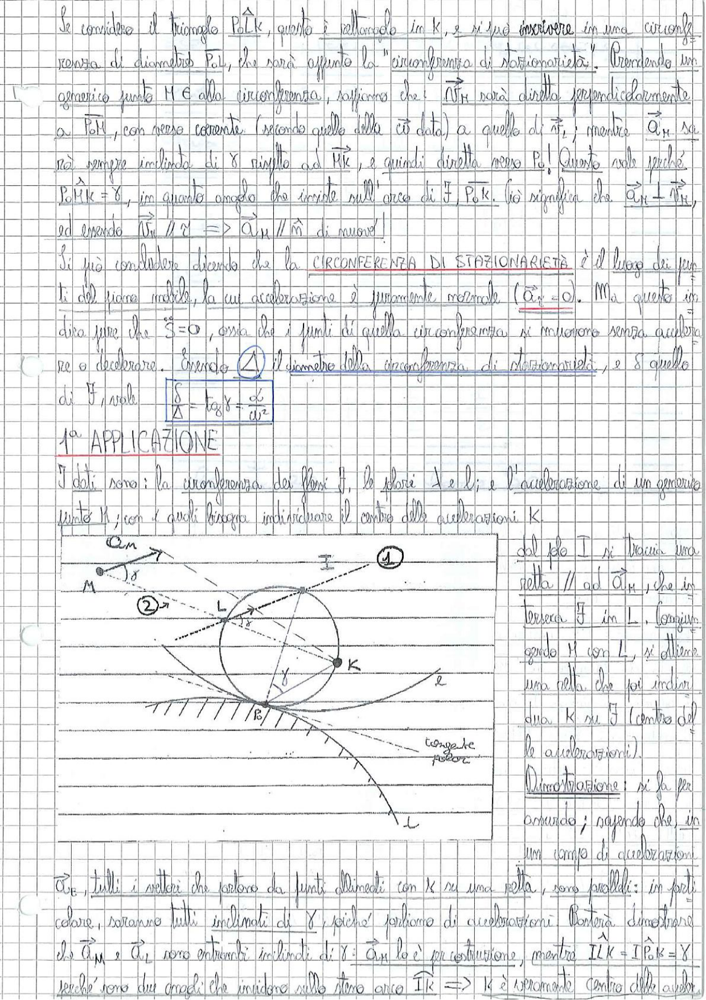

# Page 33 - Circonferenza di Stazionarietà e 1ª Applicazione

Se considero il triangolo $P\hat{o}K$, questo è rettangolo in K, e si può inscrivere in una circonferenza di diametro $P_ol$, che sarà appunto la "circonferenza di stazionarietà". Prendendo un generico punto $M \in$ alla circonferenza, sappiamo che: $\vec{v}_M$ sarà diretto perpendicolarmente a $\overline{P_oM}$, con verso corrente (secondo quello della $\omega$ data) a quello di $\vec{v}_i$; mentre $\vec{a}_M$ sarà sempre inclinato di $\gamma$ rispetto ad $\overline{MK}$, e quindi diretta verso $P_o$! Questo vale perché $P_o\hat{M}K = \gamma$, in quanto angolo che insiste sull'arco di $P_oK$. Ciò significa che $\vec{a}_M \perp \vec{v}_M$, ed essendo $\vec{v}_M // \vec{v}$ $\Rightarrow$ $\vec{a}_M // \hat{n}$ di nuovo!

Si può concludere dicendo che la **CIRCONFERENZA DI STAZIONARIETÀ** è il luogo dei punti del piano mobile, la cui accelerazione è puramente normale ($\vec{a}_t = 0$). Ma questo significa dire pure che $S = 0$, ossia che i punti di quella circonferenza si muovono senza accelerare o decelerare. Essendo $\Delta$ il diametro della circonferenza di stazionarietà, e $\delta$ quello di $\mathcal{F}$, vale:

$$\boxed{\frac{\delta}{\Delta} = \tan\gamma = \frac{\dot{\omega}}{\omega^2}}$$

---

## 1ª APPLICAZIONE

I dati sono: la circonferenza dei flessi $\mathcal{F}$, le polari $\lambda$ e $l$; e l'accelerazione di un generico punto M; con i quali bisogna individuare il centro delle accelerazioni K.

> 
> Diagramma: Costruzione geometrica per individuare il centro delle accelerazioni K. Si mostra il punto M con il vettore accelerazione $\vec{a}_M$, la circonferenza dei flessi $\mathcal{F}$ con centro e diametro indicati, il polo I, i punti L e K, la retta tangente alla polare e il punto $P_o$. Sono indicati gli angoli $\delta$, $\gamma$ e le costruzioni ausiliarie con rette tratteggiate.

Dal polo I si traccia una retta $//$ ad $\vec{a}_M$, che interseca $\mathcal{F}$ in L. Congiungendo M con L, si ottiene una retta che poi individua K su $\mathcal{F}$ (centro delle accelerazioni).

**Dimostrazione:** si fa per assurdo; sapendo che in un campo di accelerazioni $\vec{a}_E$, tutti i vettori che partono da punti allineati con K su una retta, sono paralleli: in particolare, saranno tutti inclinati di $\gamma$, perché sappiamo di accelerazioni. Basterà dimostrare che $\vec{a}_M$ e $\vec{a}_L$ sono entrambi inclinati di $\gamma$: $\vec{a}_M$ lo è per costruzione, mentre $\widehat{ILK} = \widehat{IP_oK} = \gamma$ perché sono due angoli che insidono sullo stesso arco $\widehat{IK}$ $\Rightarrow$ K è veramente centro delle accelerazioni.
