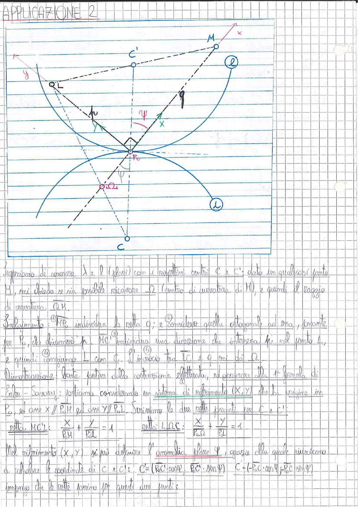

# Page 34 - Applicazione 2: Costruzione del centro di curvatura

## APPLICAZIONE 2

> 
> Diagramma: Due curve polari $\ell$ (fissa) e $\lambda$ (mobile) tangenti nel punto $P_0$, con i rispettivi centri $C$ e $C'$. Sono indicati il punto $M$ sulla curva $\ell$, il punto $L$, il centro di curvatura $\Omega$, la retta $q$ passante per $P_0$, la normale $h$, e il sistema di riferimento $(X, Y)$ con origine in $P_0$. L'angolo $\psi$ è indicato tra la normale e la retta $P_0C$.

---

Supponiamo di conoscere $\lambda$ e $\ell$ (polari) con i rispettivi centri $C$ e $C'$: dato un qualsiasi punto $M$, mi chiedo se sia possibile ricavare $\Omega$ (centro di curvatura di $M$), e quindi il raggio di curvatura $\overline{\Omega M}$.

**Svolgimento:** ① $\overline{ME}$ individua la retta $q$; ② e considero quella ortogonale ad essa, passante per $P_0$, che chiamerò $h$. ③ $\overline{MC'}$ individua una direzione che interseca $h$ nel punto $L$, ④ e quindi congiungo $L$ con $C$. ⑤ L'incrocio tra $\overline{LC}$ e $q$ mi dà $\Omega$.

**Dimostrazione:** basta partire dalla costruzione effettuata, ed arrivare alla 1ª formula di Euler-Savary: partiamo considerando un sistema di riferimento $(X, Y)$ che ha origine in $P_0$, ad asse $X \parallel P_0 M$ ed asse $Y \parallel P_0 L$. Scriviamo le due rette passanti per $C$ e $C'$:

$$\boxed{\text{retta } MC': \quad \frac{X}{P_0 M} + \frac{Y}{P_0 L} = 1}$$

$$\boxed{\text{retta } L\Omega C: \quad \frac{X}{P_0 \Omega} + \frac{Y}{P_0 L} = 1}$$

Nel riferimento $(X, Y)$, si può definire l'anomalia (bare) $\psi$, grazie alla quale riusciamo a calcolare le coordinate di $C$ e $C'$:

$$\underline{C'} = (P_0 C' \cos\psi, \; P_0 C' \cdot \sin\psi) \qquad \underline{C} = (-P_0 C \cdot \cos\psi, \; P_0 C \cdot \sin\psi)$$

Impongo che le rette passino per questi due punti:
