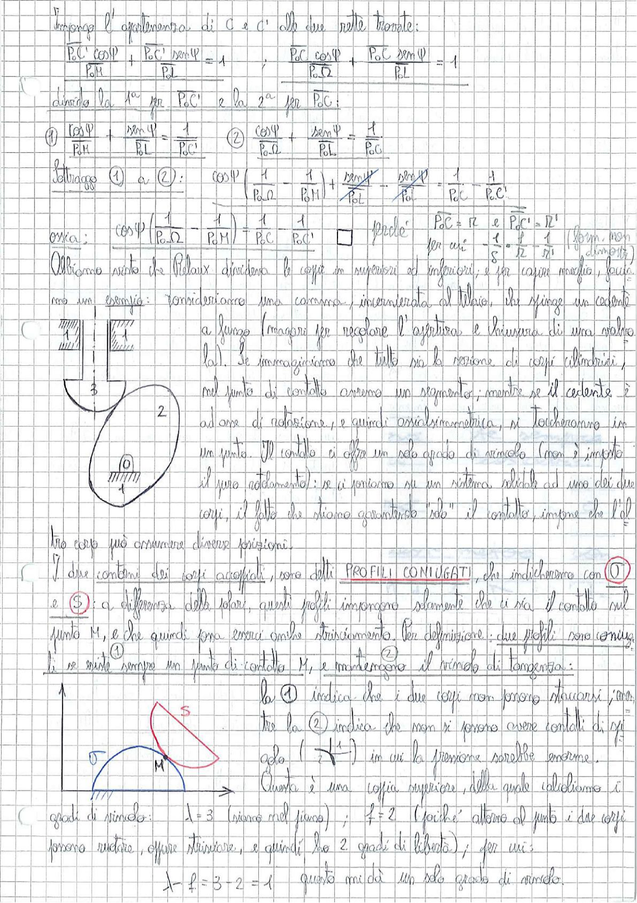

# Page 35 - Profili Coniugati e Coppie Superiori

Impongo l'appartenenza di $C$ e $C'$ alle due rette trovate:

$$\frac{P_0 C \cos\psi}{P_0 M} + \frac{P_0 C' \sin\psi}{P_0 L} = 1 \qquad \frac{P_0 C \cos\psi}{P_0 \Omega} + \frac{P_0 C \sin\psi}{P_0 L} = 1$$

Divido la $1^a$ per $P_0 C'$ e la $2^a$ per $P_0 C$:

$$(1) \quad \frac{\cos\psi}{P_0 M} + \frac{\sin\psi}{P_0 L} = \frac{1}{P_0 C'} \qquad (2) \quad \frac{\cos\psi}{P_0 \Omega} + \frac{\sin\psi}{P_0 L} = \frac{1}{P_0 C}$$

Sottraggio $(1)$ a $(2)$:

$$\cos\psi \left(\frac{1}{P_0 \Omega} - \frac{1}{P_0 M}\right) + \cancel{\frac{\sin\psi}{P_0 L}} = \frac{1}{P_0 C} - \frac{1}{P_0 C'}$$

ossia:

$$\cos\psi \left(\frac{1}{P_0 \Omega} - \frac{1}{P_0 M}\right) = \frac{1}{P_0 C} - \frac{1}{P_0 C'}$$

perché $P_0 C = r_2$ e $P_0 C' = r_2'$

$$\boxed{\text{per cui} \quad -\frac{1}{S} = \frac{1}{r_2} - \frac{1}{r_1} \quad \text{(form. non dimostrata)}}$$

---

Abbiamo visto che Reuleaux divideva le coppie in superiori ed inferiori; e per capire meglio, facciamo un esempio: consideriamo una corsorama, incardinata al telaio, che spinge un cedente a fungo (magari per regolare l'apertura e la chiusura di una valvola). Se immaginiamo che tutto sia la sezione di corpi cilindrici, nel punto di contatto avremo un segmento; mentre se il cedente è ad asse di rotazione, e quindi assialsimmetrica, si toccheranno in un punto. Il contatto ci offre un solo grado di vincolo (non si impone il puro rotolamento): se ci poniamo su un sistema solidale ad uno dei due corpi, il fatto che siano a contatto "solo" il contatto, impone che l'altro corpo può assumere diverse posizioni.

> 
> Diagramma: Schema di un meccanismo camma-cedente a fungo con telaio (0), camma (elemento 2 con profilo ellittico), cedente (elemento 3, asta verticale con fungo), e vincolo al telaio. A destra, altro schema con camma (5) a contatto nel punto M con cedente semicircolare (elemento collegato al telaio 0).

I due contorni dei corpi accoppiati, sono detti **PROFILI CONIUGATI**, che indicheremo con $(1)$ e $(5)$: a differenza delle solari, questi profili impongono solamente che ci sia il contatto nel punto $M$, e che quindi possa esserci anche strisciamento. Per definizione: due profili sono coniugati se esiste sempre un punto di contatto $M$, e mantengono il vincolo di tangenza:

- la $(1)$ indica che i due corpi non possono staccarsi, anzi
- tra la $(2)$ indica che non ci possono essere contatti di spigolo ($\frac{1}{4}$) in cui la pressione sarebbe enorme.

Questa è una coppia superiore, della quale calcoliamo i gradi di vincolo:

$$\lambda = 3 \quad \text{(siamo nel piano)} \; ; \quad f = 2 \quad \text{(poiché attorno al punto i due corpi possono ruotare, oppure strisciare, e quindi ha 2 gradi di libertà)} \; ; \quad \text{per cui:}$$

$$\boxed{l = f = 3 - 2 = 1} \quad \text{questo mi dà un solo grado di vincolo.}$$
