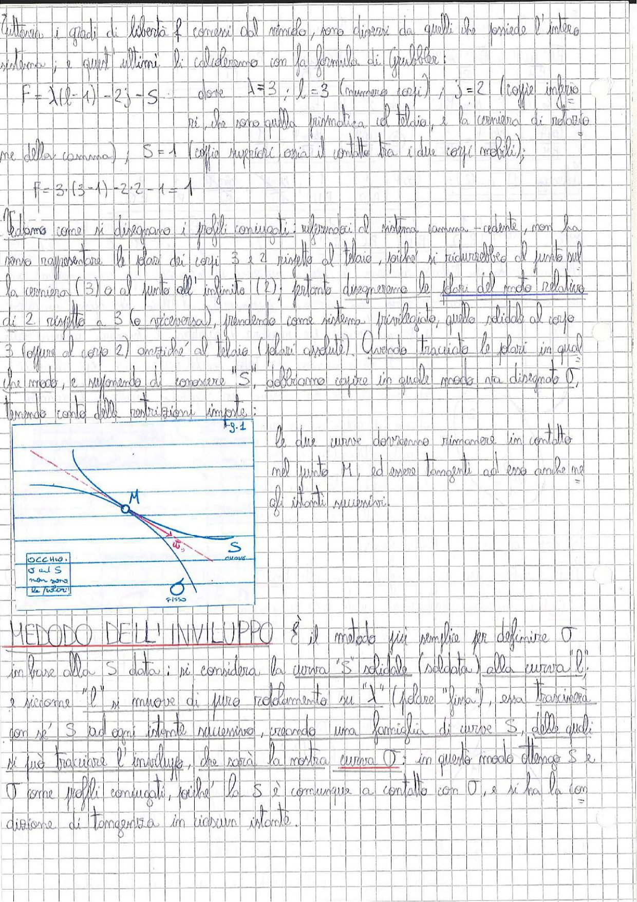

# Page 36 - Profili Coniugati e Metodo dell'Inviluppo

Tuttavia i gradi di libertà $f$ connessi dal simbolo, sono diversi da quelli che possiede l'intero sistema; e quest'ultimi li calcoleremo con la formula di Grübler:

$$F = \lambda(l - 1) - 2j - S$$

dove $\lambda = 3$; $l = 3$ (numero corpi); $j = 2$ (coppie inferiori, che sono quella prismatica, il telaio, e la cerniera di rotazione della camma); $S = 1$ (coppie superiori, ossia il contatto tra i due corpi mobili);

$$\boxed{F = 3 \cdot (3 - 1) - 2 \cdot 2 - 1 = 1}$$

Vediamo come si disegnano i profili coniugati: riferendoci al sistema camma-cedente, non sapremmo rappresentare le polari dei corpi 3 e 2 rispetto al telaio, poiché si ridurrebbero al punto sulla cerniera (3) o al punto all'infinito (2); pertanto disegneremo le **polari del moto relativo** di 2 rispetto a 3 (o viceversa), prendendo come sistema privilegiato quello solidale al corpo 3 (oppure al corpo 2) anziché al telaio (polari assolute). Quando tracciato le polari in qual che modo, e supponendo di conoscere "S", dobbiamo capire in quale modo va disegnato O, tenendo conto delle restrizioni imposte:

> 
> Diagramma: Schema di un meccanismo camma-cedente con profilo S (curva solidale alla cedente) e profilo O (fisso). Si vedono il punto di contatto M, il centro di curvatura, e le due curve che devono rimanere in contatto e tangenti nel punto M ad ogni istante successivo. Annotazione: "OCCHIO: O ed S non sono le polari!"

Le due curve dovranno rimanere in contatto nel punto M, ed essere tangenti ad esso anche negli istanti successivi.

---

## METODO DELL'INVILUPPO

È il metodo più semplice per definire O in base alla S data: si considera la curva "S" solidale (saldato) alla curva $l$; e siccome "$l$" si muove di puro rotolamento su "$\lambda$" (polare "fissa"), essa trascinerà con sé S ad ogni istante successivo, creando una **famiglia di curve S**, delle quali si può tracciare l'inviluppo, che sarà la nostra curva O; in questo modo ottengo S e O come **profili coniugati**, poiché la S è comunque a contatto con O, e si ha la condizione di tangenza in ciascun istante.
