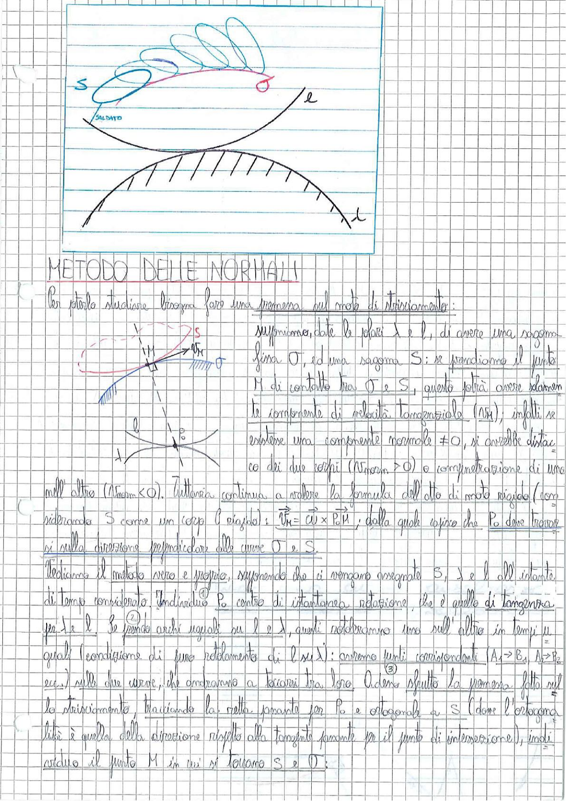

# Page 37 - Metodo delle Normali

> 
> Diagramma: Camma con sagoma S saldata ad un profilo e, con indicazione del moto di strisciamento tra le superfici

---

## METODO DELLE NORMALI

Per poterlo studiare bisogna fare una premessa sul moto di strisciamento:

> 
> Diagramma: Due curve (sagoma S e profilo O) a contatto nel punto M, con indicazione delle velocità tangenziali e normali, e il centro di rotazione $P_0$

Supponiamo, date le parti $\lambda$ e $l$, di avere una sagoma fissa $O$, ed una sagoma $S$: se prendiamo il punto $M$ di contatto tra $O$ e $S$, questo potrà avere solamente la componente di velocità tangenziale ($V_M$), infatti se esistesse una componente normale $\neq 0$, si avrebbe distacco dei due corpi ($V_{norm} > 0$) o compenetrazione di uno nell'altro ($V_{norm} < 0$). Tuttavia continua a valere la formula dell'atto di moto rigido (considerando $S$ come un corpo rigido):

$$\boxed{\vec{V_M} = \vec{\omega} \times \vec{P_0 M}}$$

dalla quale segue che $P_0$ deve trovarsi sulla direzione perpendicolare alle curve $O$ e $S$.

Vediamo il metodo vero e proprio, supponendo che ci vengano assegnate $S$, $\lambda$ e $l$ all'istante di tempo considerato:

1. Individuiamo $P_0$ centro di istantanea rotazione, che è quello di tangenza per $\lambda$ e $l$.

2. Se prendo archi uguali su $l$ e $\lambda$, questi rotoleranno uno sull'altro in tempi uguali (condizione di puro rotolamento di $l$ su $\lambda$): avremo punti corrispondenti ($A_1 \to B_1$, $A_2 \to B_2$, ecc.) sulle due curve, che andranno a toccarsi tra loro.

3. Adesso sfrutto la premessa fatta sul lo strisciamento, tracciando la retta passante per $P_0$ e ortogonale a $S$ (dove l'ortogonalità è quella della direzione rispetto alla tangente alla tangente passante per il punto di intersezione), individuando il punto $M$ in cui si toccano $S$ e $O$:
