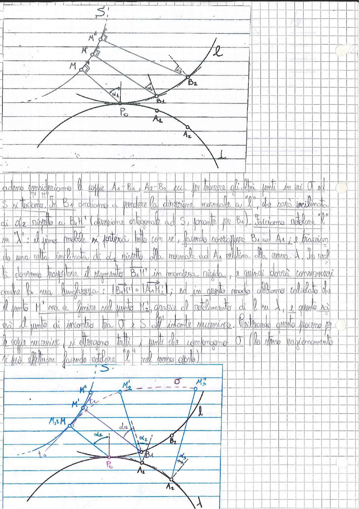

# Page 38 - Costruzione Geometrica dei Punti della Curva σ (Polòdia Fissa)

> 
> Diagramma: Costruzione geometrica per trovare i punti successivi della curva σ (polòdia fissa). Si vedono la curva S, la retta l, i punti M, M', M'', i punti $A_1$, $A_2$, $B_1$, $B_2$, il punto $P_0$, le normali e le distanze $d_1$, $d_2$. Il secondo diagramma mostra la stessa costruzione con maggiore dettaglio, includendo le posizioni successive $M_1 \equiv M$, $M'$, $M''$, $M_2'$, $M_2''$ e le tangenti.

---

Adesso consideriamo le coppie $A_1$-$B_1$, $A_2$-$B_2$ ecc. Per trovare gli altri punti in cui $\sigma$ ed $S$ si toccano, in $B_1$ andiamo a prendere la direzione normale a "$l$", che sarà inclinata di $d_2$ rispetto a $B_1 M'$ (direzione ortogonale ad $S$, passante per $B_1$). Facciamo rotolare "$l$" su "$\lambda$": il piano mobile si porterà tutto con sé, facendo sovrapporre $B_1$ ad $A_1$; e tracciando una retta inclinata di $d_2$ rispetto alla normale ad $A_1$ relativa alla curva $\lambda$. In realtà dovremo trasportare il segmento $B_1 M'$ in maniera rigida, e quindi dovrà conservarsi anche la sua lunghezza: $|B_1 M'| = |A_1 M_2'|$; ed in questo modo abbiamo calcolato che il punto $M'$ va a finire sul punto $M_2'$, grazie al rotolamento di $l$ su $\lambda$, e questo è già il punto di incontro tra $\sigma$ e $S$ all'istante successivo. Reiterando questo processo per le coppie successive, si ottengono tutti i punti che compongono $\sigma$ (lo stesso ragionamento si può effettuare facendo rotolare "$l$" nel verso opposto).
