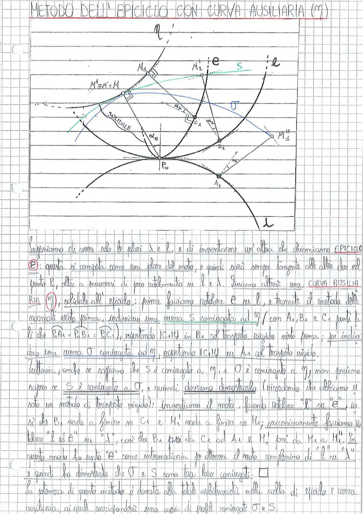

# Page 39 - Metodo dell'Epiciclo con Curva Ausiliaria (m)

## METODO DELL'EPICICLO CON CURVA AUSILIARIA (m)

> 
> Diagramma: Costruzione geometrica del metodo dell'epiciclo con curva ausiliaria. Si vedono le curve $l$ (blu) e $\lambda$ (nera) tangenti nel punto $P_0$, l'epiciclo $e$ (verde) tangente ad entrambe, i punti $M_1$, $M_2$, $M'' = M' = M$, la curva $S$ e la curva $\sigma$ coniugate rispettivamente a $m$ e $m$. Sono indicati i punti $A_1$, $B_1$, $C_1$, $K_1$ e le relative costruzioni con trasporto rigido. La notazione "SOLIDALE" appare vicino al centro della costruzione.

---

Supponiamo di avere solo le ruote $l$ e $\lambda$, e di inventarne un'altra che chiamiamo EPICICLO ($\mathbf{e}$): questa si comporta come una ruota del moto, e quindi sarà sempre tangente alle altre due nel punto $P_0$, oltre a muoversi di puro rotolamento su $l$ e $\lambda$. Troviamo altresì una **CURVA AUSILIARIA** ($\mathbf{m}$), solidale all'epiciclo; prima facciamo rotolare $e$ su $l$, e tramite il metodo delle normali visto prima, individuiamo una **curva $S$ coniugata ad $m$** (con $A_1$, $B_1$ e $C_1$ punti tali che $P_0 A_1 = P_0 B_1 = P_0 C_1$), riportando $|C_1 M_1|$ in $B_1$ col trasporto rigido visto prima; poi individuiamo una **curva $\sigma$ coniugata ad $m$**, riportando $|C_1 M_1|$ su $A_1$ col trasporto rigido.

Tuttavia, anche se sappiamo che $S$ è coniugata a $m$, e $\sigma$ è coniugata a $m$, non possiamo sapere se $S$ è coniugata a $\sigma$, e quindi dobbiamo dimostrarlo (ricordando che abbiamo usato un metodo di trasporto rigido): invertiamo il moto, facendo rotolare "$l$" su "$e$", così che $B_1$ vada a finire su $C_1$ e $M_1$ vada a finire su $K_1$; successivamente facciamo rotolare "$l$ ed $e$" su "$\lambda$", così che $B_1$ passi da $C_1$ ad $A_1$ e $K_1$ passi da $M_1$ a $M_1''$. In questo modo ho usato "$e$" come intermediaria per ottenere il moto complessivo di $l$ su "$\lambda$" e quindi ho dimostrato che $\sigma$ e $S$ sono tra loro coniugati. $\square$

La potenza di questo metodo è dovuta alla totale arbitrarietà nella scelta di epiciclo e curva ausiliaria, ai quali corrisponderà una coppia di profili coniugati $\sigma$ e $S$.
