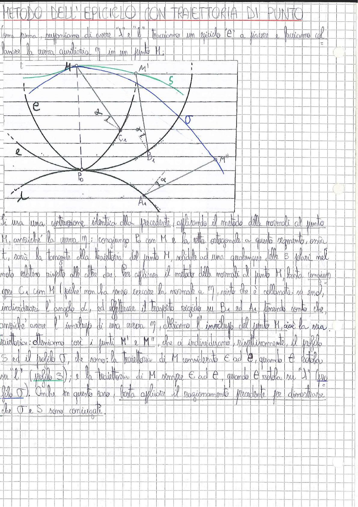

# Page 40 - Metodo dell'Epiciclo con Traiettoria di Punto

## METODO DELL'EPICICLO CON TRAIETTORIA DI PUNTO

Come prima, supponiamo di avere "S" e "l"; tracciamo un epiciclo "e" a piacere e facciamo rotolare la curva ausiliaria $\sigma$ in un punto M.

> 
> Diagramma: Costruzione geometrica del metodo dell'epiciclo con traiettoria di punto. Si vedono: l'epiciclo "e" (curva grande a sinistra), il profilo "S" (curva verde in alto a destra), il profilo "σ" (curva blu in alto), la tangente $t$ nel punto M, i punti $M$, $M'$, $M''$, $C_1$, $B_1$, $A_1$, $P_0$, l'angolo $\alpha$, e le costruzioni geometriche delle normali e tangenti. Le curve e ed σ sono rappresentate con i rispettivi centri e raggi.

---

Si usa una costruzione identica alla precedente, applicando il metodo delle normali al punto M, anziché la curva $\sigma$: congiungo $P_0$ con M e la retta ortogonale a questo segmento, ossia $t$, sarà la tangente alla traiettoria del punto M, solidale ad una qualunque delle 3 ydari nel moto relativo rispetto alle altre due. Per applicare il metodo delle normali al punto M, basta congiungere $C_1$ con M (poiché non ha senso cercare la normale a $\sigma$, visto che è collassata su essa), individuare l'angolo $\alpha$, ed effettuare il trasporto rigido su $B_1$ ed $A_1$, tenendo conto che, anziché avere l'inviluppo di una curva $\sigma$, abbiamo l'inviluppo del punto M, cioè la sua traiettoria: otteniamo così i punti $M'$ e $M''$, che ci individuano, rispettivamente, il profilo S ed il profilo σ, che sono: la traiettoria di M considerato E ad e, quando e rotola su "l" (profilo S); e la traiettoria di M, sempre E ad e, quando e rotola su "S" (profilo σ). Anche in questo caso, basta applicare il ragionamento precedente per dimostrare che σ e S sono coniugati.
