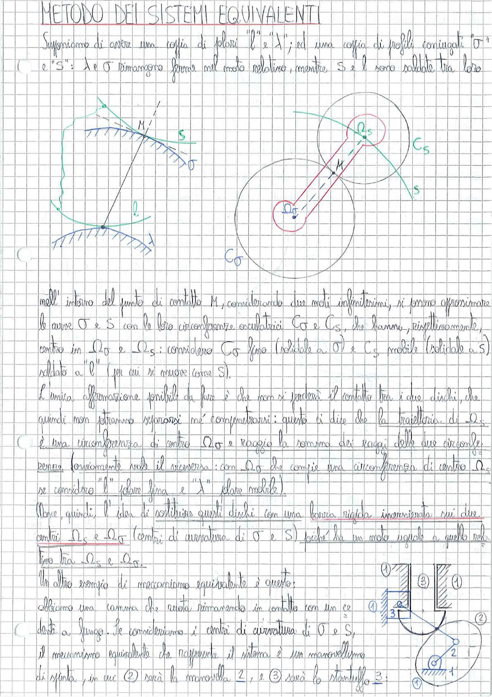

# Page 41 - Metodo dei Sistemi Equivalenti

## METODO DEI SISTEMI EQUIVALENTI

Supponiamo di avere una coppia di polari "$l$" e "$\lambda$"; ed una coppia di profili coniugati "$\sigma$" e "$S$": $\lambda$ e $\sigma$ rimangono ferme nel moto relativo, mentre $S$ e $l$ sono saldate tra loro.

> 
> Diagramma: A sinistra, coppia di profili coniugati σ e S con punto di contatto M e polari l e λ. A destra, cerchi osculatori $C_S$ e $C_\sigma$ con centri $\Omega_S$ e $\Omega_\sigma$ nel punto di contatto M.

Nell'intorno del punto di contatto $M$, considerando due moti infinitesimi, si possono approssimare le curve $\sigma$ e $S$ con le loro circonferenze osculatrici $C_\sigma$ e $C_S$, che hanno, rispettivamente, centro in $\Omega_\sigma$ e $\Omega_S$: considero $C_\sigma$ fissa (solidale a $\sigma$) e $C_S$ mobile (solidale a $S$) saldata a "$l$" (per cui si muove come $S$).

L'unica affermazione possibile da fare è che non si perderà il contatto tra i due dischi, che quindi non potranno separarsi né compenetrarsi: questo è dire che la traiettoria di $\Omega_S$ è una circonferenza di centro $\Omega_\sigma$ e raggio la somma dei raggi delle due circonferenze, senza ovviamente avere il viceversa: con $\Omega_\sigma$ che compie una circonferenza di centro $\Omega_S$ se considero "$l$" (disco fisso) e "$\lambda$" (disco mobile).

Nasce, quindi, l'idea di sostituire questi dischi con una barra rigida incernierata sui due centri $\Omega_S$ e $\Omega_\sigma$ (centri di curvatura di $\sigma$ e $S$) poiché ha un moto uguale a quello relativo tra $\Omega_S$ e $\Omega_\sigma$.

Un altro esempio di meccanismo equivalente è questo:

Abbiamo una camma che ruota rimanendo in contatto con un ce ① detto a fungo. Se consideriamo i centri di curvatura di $\sigma$ e $S$, il meccanismo equivalente che rappresenta il sistema è un manovellismo di spinta, in cui ② sarà la manovella $\underline{2}$, e ③ sarà lo stantuffo $\underline{3}$.

> 
> Diagramma: Schema di meccanismo camma-punteria a fungo (①) con il suo meccanismo equivalente: manovellismo di spinta con manovella ② e stantuffo ③, collegati al telaio ④.
