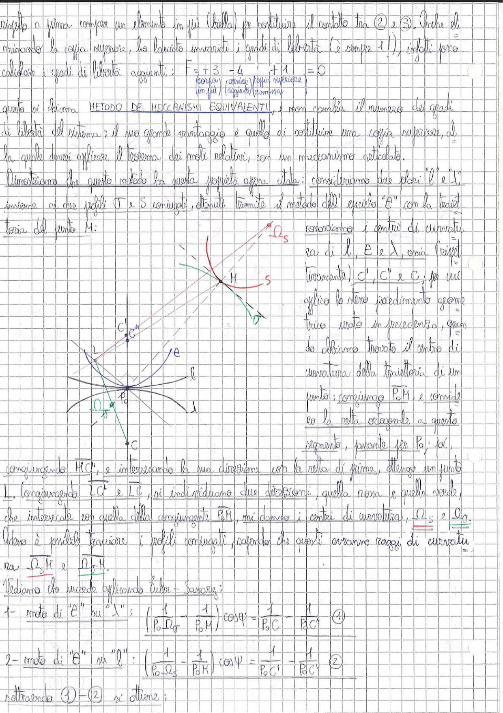

# Page 42 - Metodo dei Meccanismi Equivalenti e Centri di Curvatura dei Profili Coniugati

rispetto a prima compare un elemento in più (biella) per sostituire il contatto tra (2) e (3). Anche eliminando la coppia superiore, ho lasciato invariati i gradi di libertà (è sempre 1), infatti sono calcolore i gradi di libertà aggiunti:

$$F = +3 \underbrace{-4}_{\text{(corpi in più)}} \underbrace{+1}_{\text{(cerniere aggiunte)}} \underbrace{}_{\text{(coppia superiore rimossa)}} = 0$$

Questo si chiama **METODO DEI MECCANISMI EQUIVALENTI**, e non cambia il numero dei gradi di libertà del sistema; il suo grande vantaggio è quello di sostituire una coppia superiore, alla quale dovrei applicare il teorema dei moti relativi, con un meccanismo articolato.

Dimostriamo che questo metodo ha questa proprietà: affin. stata: consideriamo due stari "$l$" e "$\lambda$", insieme ai due profili $\Gamma$ e $S$ coniugati, ottenuti tramite il metodo dell'epiciclo "$\mathcal{E}$", con la traiettoria del punto M:

> 
> Diagramma: Costruzione geometrica per la determinazione dei centri di curvatura $\Omega_S$ e $\Omega_\delta$ dei profili coniugati. Si vedono i profili $l$ e $\lambda$, il punto di contatto M, il punto $P_0$, i centri di curvatura $C'$, $C''$ e $C$, e le rette congiungenti che permettono di individuare $\Omega_S$ e $\Omega_\delta$ tramite intersezioni.

Conosciamo i centri di curvatura di $l$, $e$ e $\lambda$, ossia (rispettivamente) $C''$, $C'$ e $C$; per cui applichiamo lo stesso procedimento geometrico usato in precedenza, quando abbiamo trovato il centro di curvatura della traiettoria di un punto: congiungo $\overline{P_0 M}$ e considero la retta ortogonale a questo segmento, passante per $P_0$; poi,

congiungendo $\overline{MC''}$, e intersecando la sua direzione con la retta di prima, ottengo un punto L. Congiungendo $\overline{LC'}$ e $\overline{LC}$, si individuano due direzioni, quella rosa e quella verde, che intersecate con quella della congiungente $\overline{P_0 M}$, mi danno i centri di curvatura, $\underline{\Omega_S}$ e $\underline{\Omega_\delta}$.

Adesso è possibile tracciare i profili coniugati, sapendo che questi avranno raggi di curvatura $\overline{\Omega_S M}$ e $\overline{\Omega_\delta M}$.

Vediamo che succede applicando Euler-Savary:

**1- moto di "$\mathcal{E}$" su "$\lambda$":**

$$\boxed{\left(\frac{1}{\overline{P_0 \Omega_\delta}} - \frac{1}{\overline{P_0 M}}\right) \cos\psi = \frac{1}{\overline{P_0 C}} - \frac{1}{\overline{P_0 C'}} \quad (1)}$$

**2- moto di "$\mathcal{E}$" su "$l$":**

$$\boxed{\left(\frac{1}{\overline{P_0 \Omega_S}} - \frac{1}{\overline{P_0 M}}\right) \cos\psi = \frac{1}{\overline{P_0 C'}} - \frac{1}{\overline{P_0 C''}} \quad (2)}$$

Sottraendo (1) - (2) si ottiene:
