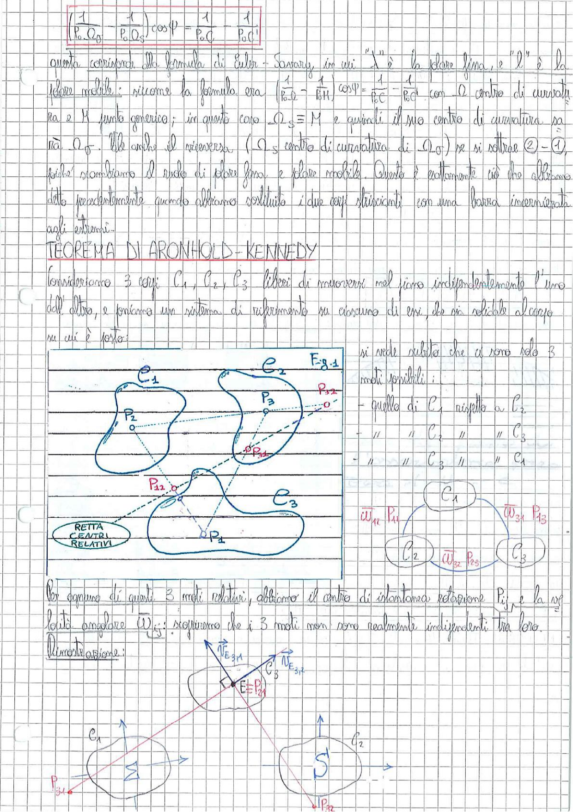

# Page 43 - Formula di Euler-Savary e Teorema di Aronhold-Kennedy

$$\boxed{\left(\frac{1}{P_0 Q_0} \pm \frac{1}{P_0 Q_s}\right) \cos \psi = \frac{1}{P_0 C} - \frac{1}{P_0 C'}}$$

Questa corrisponde alla formula di Euler-Savary, in cui "1" è la *polare fissa*, e "2" è la *polare mobile*; siccome la formula era $\left(\frac{1}{P_0 Q} - \frac{1}{P_0 H}\right) \cos \psi = \frac{1}{P_0 C} - \frac{1}{P_0 C'}$ con $Q$ centro di curvatura e $H$ punto generico; in questo caso $Q_S \equiv M$ e quindi il suo centro di curvatura sarà $Q_f$. Vale anche il viceversa. ($Q_S$ centro di curvatura di $Q_f$) se si sottraggono ② - ①, poiché scambiamo il ruolo di *polare fissa* e *polare mobile*. Questo è esattamente ciò che abbiamo detto precedentemente quando abbiamo sostituito i due corpi striscianti con una barra incernierata agli estremi.

---

## TEOREMA DI ARONHOLD-KENNEDY

Consideriamo 3 corpi $C_1$, $C_2$, $C_3$ liberi di muoversi nel piano indipendentemente l'uno dall'altro, e fissiamo un sistema di riferimento su ciascuno di essi, che sia solidale al corpo su cui è posto.

> 
> Diagramma: Tre corpi $C_1$, $C_2$, $C_3$ nel piano con i centri di istantanea rotazione $P_2$, $P_3$, $P_{12}$, $P_{31}$, $P_{22}$, $P_1$ indicati. È evidenziata la "Retta Centri Relativi" che passa per i tre centri di istantanea rotazione. A destra, schema con i 3 corpi collegati e le velocità angolari $\vec{\omega}_{41}$, $\vec{\omega}_{31}$, $\vec{\omega}_{32}$ con i rispettivi poli $P_{41}$, $P_{43}$, $P_{25}$.

Si vede subito che ci sono solo 3 moti possibili:

- quello di $C_1$ rispetto a $C_2$
- " " $C_2$ " " $C_3$
- " " $C_3$ " " $C_1$

Per ognuno di questi 3 moti relativi, abbiamo il centro di istantanea rotazione $P_{ij}$ e la relativa velocità angolare $\vec{\omega}_{ij}$; scopriremo che i 3 moti non sono realmente indipendenti tra loro.

### Dimostrazione:

> 
> Diagramma: Dimostrazione del teorema con i corpi $C_1$ e $C_2$, punto $E \equiv P_{21}$, vettori velocità $\vec{v}_{E,31}$ e $\vec{v}_{E,32}$ dal punto $E$, punto $S$ sul corpo $C_2$, e i poli $P_{31}$ e $P_{12}$ indicati.
