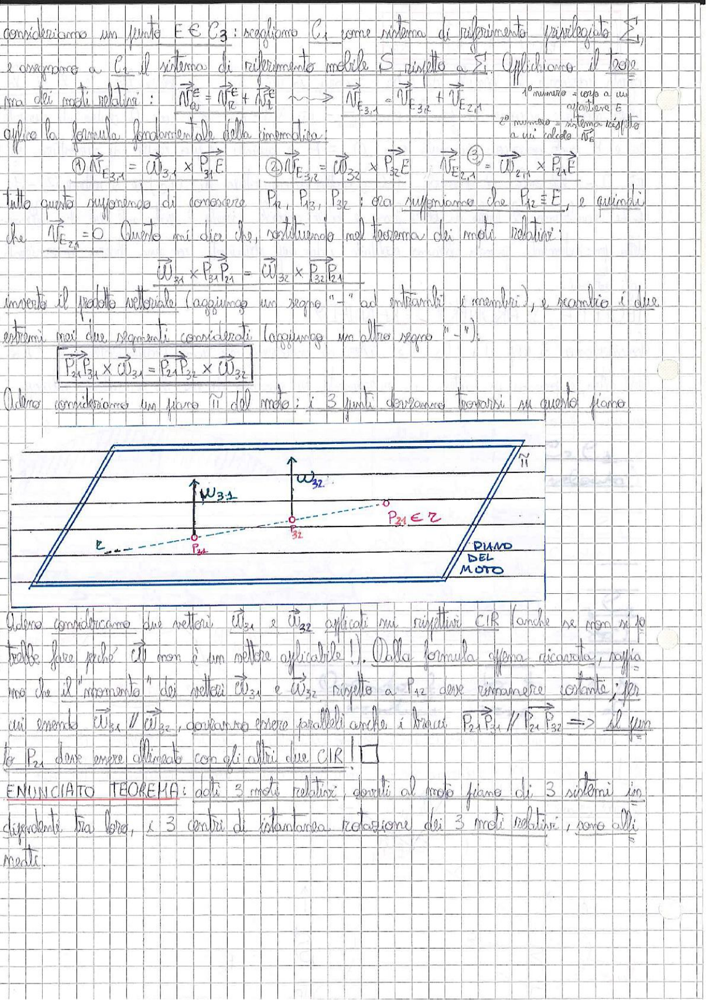

# Page 44 - Teorema dei tre CIR allineati

Consideriamo un punto $E \in C_3$: scegliamo $C_1$ come sistema di riferimento privilegiato $\Sigma_1$, e associamo a $C_1$ il sistema di riferimento mobile $S$ rispetto a $\Sigma$. Applichiamo il teorema dei moti relativi:

$$\vec{V}^E_3 = \vec{V}^E_R + \vec{V}^E_{\tau} \quad \Rightarrow \quad \vec{V}_{E,3,1} = \vec{V}_{F,3,2} + \vec{V}_{E,2,1}$$

> 1° numero = corpo a cui appartiene E
> 2° numero = sistema rispetto a cui calcolo $\vec{V}_R$

Applico la formula fondamentale della cinematica:

$$①\ \vec{V}_{E,3,1} = \vec{\omega}_{3,1} \times \vec{P_{31}E} \qquad ②\ \vec{V}_{E,3,2} = \vec{\omega}_{3,2} \times \vec{P_{32}E} \qquad ③\ \vec{V}_{E,2,1} = \vec{\omega}_{2,1} \times \vec{P_{21}E}$$

Tutto questo supponiamo di conoscere $P_{21}$, $P_{12}$, $P_{32}$: ora supponiamo che $P_{12} \equiv E$, e quindi che $\vec{V}_{E,2,1} = 0$. Questo mi dice che, sostituendo nel teorema dei moti relativi:

$$\vec{\omega}_{3,1} \times \vec{P_{31}P_{21}} = \vec{\omega}_{3,2} \times \vec{P_{32}P_{21}}$$

inverto il prodotto vettoriale (aggiungo un segno "-" ad entrambi i membri), e scambio i due estremi nei due segmenti considerati (aggiungo un altro segno "-"):

$$\boxed{\overline{P_{21}P_{31}} \times \vec{\omega}_{3,1} = \overline{P_{21}P_{32}} \times \vec{\omega}_{3,2}}$$

Adesso consideriamo un piano $\pi$ del moto; i 3 punti dovranno trovarsi su questo piano.

> 
> Diagramma: Piano del moto $\pi$ rappresentato come un parallelogramma in prospettiva, con i tre punti $P_{31}$, $P_{32}$ e $P_{21}$ disposti su una linea orizzontale tratteggiata. I vettori $\vec{\omega}_{3,1}$ e $\vec{\omega}_{3,2}$ sono rappresentati verticalmente verso l'alto, perpendicolari al piano. Il punto $P_{21} \in \pi$ è indicato con la nota "PIANO DEL MOTO".

Adesso consideriamo due vettori $\vec{\omega}_{3,1}$ e $\vec{\omega}_{3,2}$ applicati nei rispettivi CIR (anche se non si lo potrebbe fare perché $\vec{\omega}$ non è un vettore applicabile!). Quella formula appena dimostrata, significa che il "momento" dei vettori $\vec{\omega}_{3,1}$ e $\vec{\omega}_{3,2}$ rispetto a $P_{12}$ deve rimanere costante; per cui essendo $\vec{\omega}_{3,1} \parallel \vec{\omega}_{3,2}$, dovranno essere paralleli anche i bracci $\overline{P_{21}P_{31}} \parallel \overline{P_{21}P_{32}}$ $\Rightarrow$ il punto $P_{21}$ deve essere allineato con gli altri due CIR!

**ENUNCIATO TEOREMA:** dati 3 moti relativi, dovuti al moto piano di 3 sistemi indipendenti tra loro, i 3 centri di istantanea rotazione dei 3 moti relativi sono allineati.
