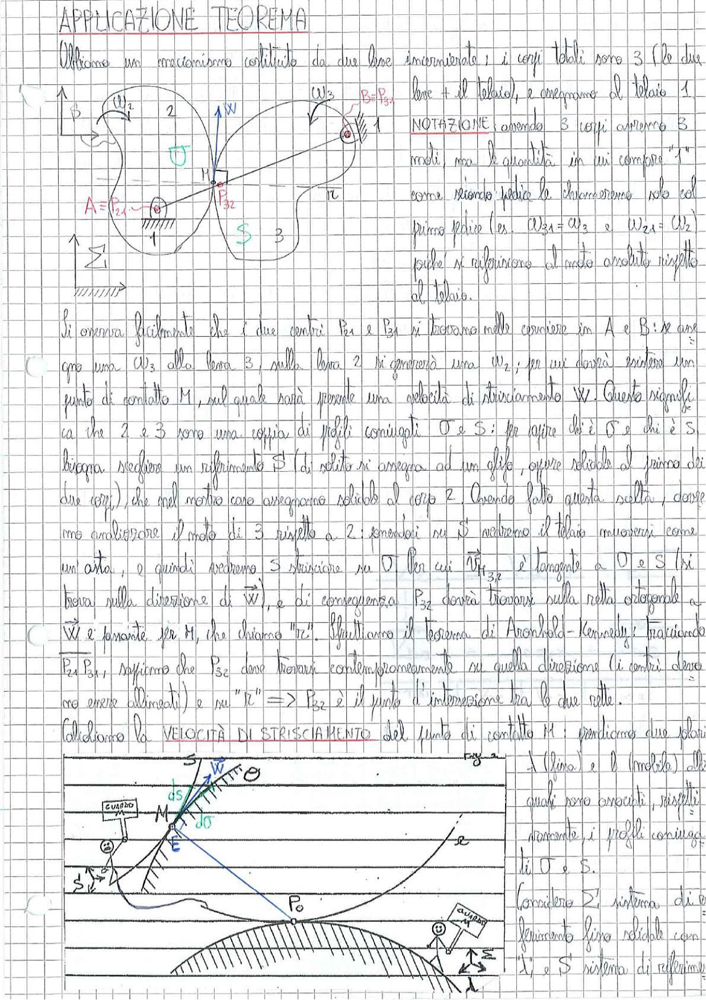

# Page 45 - Applicazione Teorema di Aronhold-Kennedy

## APPLICAZIONE TEOREMA

Abbiamo un meccanismo costituito da due bose incernierate; i corpi totali sono 3 (le due bose + il telaio), e assegniamo al telaio 1.

> 
> Diagramma: Meccanismo con due bose incernierate. Il corpo 2 (a sinistra) ruota con velocità angolare $\omega_2$ attorno alla cerniera $A \equiv P_{24}$ (fissata a telaio). Il corpo 3 (a destra) ruota con velocità angolare $\omega_3$ attorno alla cerniera $B \equiv P_{34}$. I due corpi sono a contatto nel punto M con profili coniugati O e S. La velocità di strisciamento $\vec{W}$ è indicata al punto di contatto. Il centro di istantanea rotazione relativo $P_{32}$ si trova sulla retta $\pi$ (ortogonale a $\vec{W}$ passante per M) e sulla retta $P_{24} P_{34}$.

**NOTAZIONE:** avendo 3 corpi avremo 3 moti, ma le quantità in cui compare 1 come ricordo fisico le chiameremo solo col primo pedice (es. $\omega_{31} = \omega_3$ e $\omega_{21} = \omega_2$) poiché si riferiscono al moto assoluto rispetto al telaio.

Si osserva facilmente che i due centri $P_{24}$ e $P_{34}$ si trovano nelle cerniere in A e B: se assegno una $\omega_3$ alla bosa 3, sulla bosa 2 si genererà una $\omega_2$; per cui dovrà esistere un punto di contatto M, sul quale sarà presente una velocità di strisciamento $\vec{W}$. Questo significa che 2 e 3 sono una coppia di profili coniugati O e S: per capire chi è O e chi è S bisogna scegliere un riferimento $\hat{S}$ (di solito si assegna ad un asse, oppure solidale al primo dei due corpi), che nel nostro caso assegniamo solidale al corpo 2. Avendo fatto questa scelta, dovremo analizzare il moto di 3 rispetto a 2: essendoci su $\hat{S}$ vedremo il telaio muoversi come un'asta, e quindi vedremo S strisciare su O. Per cui $\vec{v}_{P_{3,2}}$ è tangente a O e S (si trova sulla direzione di $\vec{W}$), e di conseguenza $P_{32}$ dovrà trovarsi sulla retta ortogonale a $\vec{W}$ e passante per M, che chiamo "$\pi$". Utilizzando il teorema di Aronhold-Kennedy, tracciando $P_2 P_{34}$, sappiamo che $P_{32}$ deve trovarsi contemporaneamente su quella direzione (i centri devono essere allineati) e su "$\pi$" $\Rightarrow$ $P_{32}$ è il punto d'intersezione tra le due rette.

---

## Calcoliamo la VELOCITÀ DI STRISCIAMENTO del punto di contatto M

Prendiamo due polari: $l$ (fissa) e $l$ (mobile) alle quali sono avvocati, rispettivamente, i profili coniugati di O e S.

> 
> Diagramma: Schema dettagliato del rotolamento/strisciamento tra le polari nel punto di contatto M. Si vedono: il punto M di contatto, il punto E, gli archi elementari $ds$ e $d\theta$, la velocità di strisciamento $\vec{W}$, il riferimento $\hat{S}$, il polo $P_0$, i profili O e S con le rispettive curvature, e il sistema "GUARDIA" indicato a sinistra solidale al corpo 2.

Considero $\Sigma'$ sistema di riferimento fisso solidale con $l'$ e $\hat{S}$ sistema di riferimento
