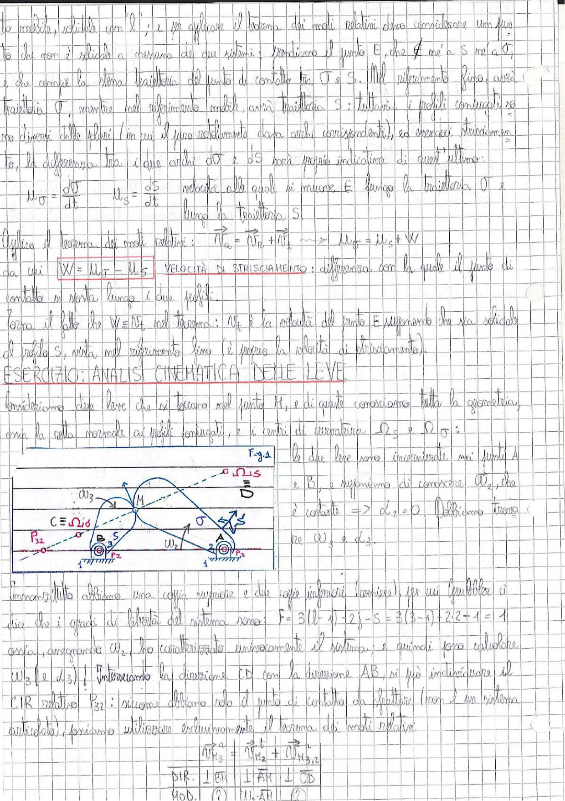

# Page 46 - Velocità di strisciamento e Analisi cinematica delle leve

## Velocità di strisciamento (continuazione)

...to mobile, solidale con l'; e per applicare il teorema dei moti relativi devo considerare un punto che non è solidale a nessuno dei due sistemi: prendiamo il punto E, che $\notin$ né a S né a $\sigma$, e che compie la stessa traiettoria del punto di contatto tra $\sigma$ e S. Nel riferimento fisso avrà traiettoria $\sigma$, mentre nel riferimento mobile avrà traiettoria S: tuttavia i profili coniugati sono diversi dalle traiettorie (in cui il puro rotolamento dava archi corrispondenti), ed emergerà strisciamento.

La differenza tra i due archi $d\sigma$ e $dS$ sarà proprio indicativa di quest'ultimo:

$$u_\sigma = \frac{d\sigma}{dt} \qquad u_S = \frac{dS}{dt}$$

velocità alle quali si muove E lungo la traiettoria $\sigma$ e lungo la traiettoria S.

Applico il teorema dei moti relativi: $\vec{v_a} = \vec{v_r} + \vec{v_t}$ $\implies$ $u_\sigma = u_S + W$

da cui:

$$\boxed{W = u_\sigma - u_S}$$

**VELOCITÀ DI STRISCIAMENTO**: differenza con la quale il punto di contatto si sposta lungo i due profili.

Nota il fatto che $W = v_t$ nel teorema: $v_t$ è la velocità del punto E (supponiamo che sia solidale al telaio S, visto nel riferimento fisso (è proprio la velocità di strisciamento).

---

## ESERCIZIO: ANALISI CINEMATICA DELLE LEVE

Consideriamo due leve che si toccano nel punto M, e di questo conosciamo tutta la geometria, ossia la retta normale ai profili coniugati, e i centri di curvatura $\Omega_S$ e $\Omega_\sigma$:

> 
> Diagramma: Schema cinematico di due leve (corpo 2 e corpo 3) che si toccano nel punto M. Le leve sono incernierate nei punti A e B rispettivamente. Si indicano i centri di curvatura $\Omega_{1S}$ e $\Omega_{1\sigma}$, le velocità angolari $\omega_2$ e $\omega_3$, il CIR relativo $P_{32}$ e il punto C coincidente con $\Omega_{2\sigma}$. La retta CD e la direzione AB sono evidenziate.

Le due leve sono incernierate nei punti A e B, e supponiamo di conoscere $\omega_2$ che è costante $\Rightarrow \dot{\omega}_2 = 0$. Dobbiamo trovare $\omega_3$ e $\dot{\omega}_3$.

Innanzitutto abbiamo una coppia superiore e due coppie inferiori (cerniere), per cui i gradi di libertà del sistema sono:

$$F = 3(l-1) - 2j_i - S = 3(3-1) - 2 \cdot 2 - 1 = 1$$

ossia, assegnando $\omega_2$, ho caratterizzato univocamente il sistema, e quindi potrò calcolare $\omega_3$ (e $\dot{\omega}_3$). Interseciamo la direzione CD con la direzione AB, si può individuare il CIR relativo $P_{32}$: siccome abbiamo solo il punto di contatto da sfruttare (non è un sistema articolato), possiamo utilizzare esclusivamente il teorema dei moti relativi:

$$\vec{v}_{M_3}^a = \vec{v}_{M_2}^t + \vec{v}_{M_{3,2}}^r$$

| | $\vec{v}_{M_3}$ | $\vec{v}_{M_2}$ | $\vec{v}_{M_{3,2}}$ |
|---|---|---|---|
| **DIR.** | $\perp$ BM | $\perp$ AM | $\perp$ CD |
| **MOD.** | (?) | $\omega_2 \cdot \overline{AM}$ | (?) |
