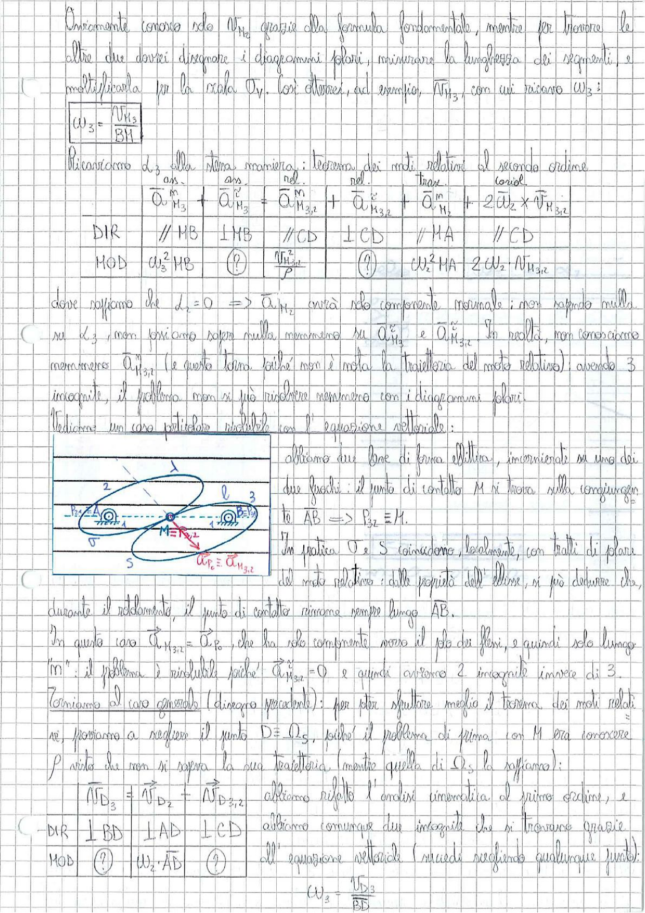

# Page 47 - Analisi cinematica delle leve (continuazione)

Ovviamente conosco solo $v_{M_2}$ grazie alla formula fondamentale, mentre per trovare le altre due dovrei disegnare i diagrammi polari, misurare la lunghezza dei segmenti, e moltiplicarla per la scala $\sigma_v$. Così otterrei, ad esempio, $v_{M_3}$, con cui ricavo $\omega_3$:

$$\boxed{\omega_3 = \frac{v_{M_3}}{BM}}$$

## Ricaviamo $\dot{\omega}_3$ alla stessa maniera: teorema dei moti relativi al secondo ordine

$$\vec{\bar{a}}_{M_3}^{ass} + \vec{\bar{a}}_{M_3}^{ass} = \vec{\bar{a}}_{M_{3,2}}^{rel} + \vec{\bar{a}}_{M_{3,2}}^{rel} + \vec{\bar{a}}_{M_1}^{tras} + 2\vec{\omega}_2 \times \vec{v}_{M_{3,2}}$$

| | $\vec{\bar{a}}_{M_3}^{ass}$ | $\vec{\bar{a}}_{M_3}^{ass}$ | $\vec{\bar{a}}_{M_{3,2}}^{rel}$ | $\vec{\bar{a}}_{M_{3,2}}^{rel}$ | $\vec{\bar{a}}_{M_1}^{tras}$ | $2\vec{\omega}_2 \times \vec{v}_{M_{3,2}}$ |
|---|---|---|---|---|---|---|
| **DIR** | // MB | $\perp$ MB | // CD | $\perp$ CD | // MA | // CD |
| **MOD** | $\omega_3^2 \cdot MB$ | (?) | $\frac{v_{M_{3,2}}^2}{\rho}$ | (?) | $\omega_2^2 \cdot HA$ | $2\omega_2 \cdot v_{M_{3,2}}$ |

dove sappiamo che $\dot{\omega}_2 = 0$ $\Rightarrow$ $\vec{a}_{M_2}$ avrà solo componente normale; non sapendo nulla su $\dot{\omega}_3$, non possiamo sapere nulla nemmeno su $\vec{a}_{M_3}^t$ e $\vec{a}_{M_{3,2}}^t$. In realtà, non conosciamo nemmeno $\vec{a}_{M_{3,2}}^n$ (e questo perché non è nota la traiettoria del moto relativo); avendo 3 incognite, il problema non si può risolvere nemmeno con i diagrammi polari.

---

## Caso particolare risolvibile con l'equazione vettoriale

> 
> Diagramma: Schema di due profili coniugati (corpi 2 e 3) con forma ellittica. Il punto di contatto M si trova sulla congiungente AB. Sono indicati: il CIR relativo $P_{32}$, i punti A e B (cerniere), le velocità angolari $\omega_2$ e $\omega_3$, il centro di curvatura $\Omega_5$, e la relazione $\vec{a}_{P_6} \equiv \vec{a}_{M_{3,2}}$.

Abbiamo due leve di forma ellittica, incernierate su uno dei due fuochi: il punto di contatto M si trova sulla congiungente AB $\Rightarrow$ $P_{32} \equiv M$.

In pratica O e S coincidono localmente, con tratti di piano del moto relativo: dalle proprietà dell'ellisse, si può dedurre che, durante il rotolamento, il punto di contatto rimane sempre lungo $\overline{AB}$.

In questo caso $\vec{a}_{M_{3,2}} = \vec{a}_{P_6}$, che ha solo componente verso il polo dei flussi, e quindi solo lungo "m": il problema è risolvibile poiché $\vec{a}_{M_{3,2}}^t = 0$ e quindi abbiamo 2 incognite invece di 3.

---

## Ritorno al caso generale

Torniamo al caso generale (disegno precedente): per poter sfruttare meglio il teorema dei moti relativi, proviamo a scegliere il punto $D \equiv \Omega_S$, poiché il problema di prima con M era conoscere $\rho$ visto che non si sapeva la sua traiettoria (mentre quella di $\Omega_S$ la sappiamo):

$$\vec{a}_{D_3} = \vec{a}_{D_2} + \vec{a}_{D_{3,2}}$$

abbiamo risolto l'analisi cinematica al primo ordine, e abbiamo comunque due incognite che si trovano grazie all'equazione vettoriale (quindi scegliendo qualunque punto):

| | $\vec{a}_{D_3}$ | $\vec{a}_{D_2}$ | $\vec{a}_{D_{3,2}}$ |
|---|---|---|---|
| **DIR** | $\perp$ BD | $\perp$ AD | $\perp$ CD |
| **MOD** | (?) | $\omega_2 \cdot \overline{AD}$ | (?) |

$$\omega_3 = \frac{v_{D_3}}{BD}$$
