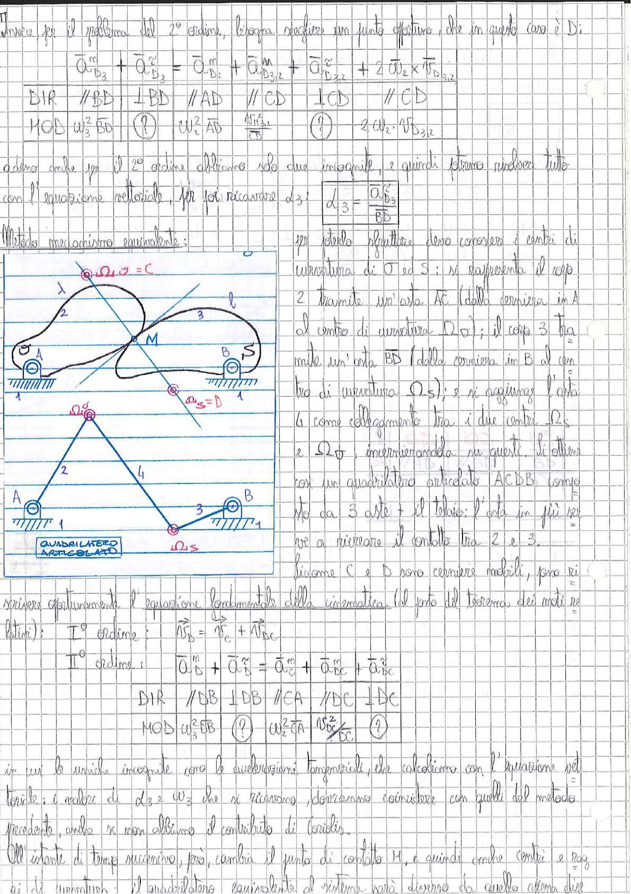

# Page 48 - Metodo del Meccanismo Equivalente (Quadrilatero Articolato)

Invece per il problema del 2° ordine, bisogna scegliere un punto opportuno, che in questo caso è D:

$$\vec{a}_{D_2}^n + \vec{a}_{D_3}^{\tau} = \vec{a}_{D_2}^n + \vec{a}_{D_{3,2}}^n + \vec{a}_{D_{3,2}}^{\tau} + 2\vec{\Omega}_2 \times \vec{v}_{D_{3,2}}$$

| DIR | $//BD$ | $\perp BD$ | $//AD$ | $//CD$ | $\perp CD$ | $//CD$ |
|-----|--------|------------|--------|--------|------------|--------|
| MOD | $\omega_3^2 \cdot BD$ | **(?)** | $\omega_2^2 \cdot AD$ | $\frac{\dot{v}_{D_{3,2}}^2}{r_{3,2}}$ | **(?)** | $2\Omega_2 \cdot v_{D_{3,2}}$ |

Adesso anche per il 2° ordine abbiamo solo due incognite, e quindi possiamo procedere tutto con l'equazione vettoriale, per poi ricavare $\dot{\omega}_3$:

$$\boxed{\dot{\omega}_3 = \frac{\vec{a}_{D_3}^{\tau}}{BD}}$$

## Metodo meccanismo equivalente:

> 
> Diagramma: Due schemi di meccanismi - in alto una camma (corpo 2) con profilo irregolare a contatto con un cedente (corpo 3) oscillante, con centri di curvatura $\Omega_\sigma$ e $\Omega_S$; in basso il quadrilatero articolato equivalente ACDB con aste numerate (1, 2, 3, 4), cerniere in A e B fisse a telaio, e punto di contatto M.

Per poterlo sfruttare devo conoscere i centri di curvatura di $\sigma$ e $S$: si rappresenta il corpo 2 tramite un'asta AC (dalla cerniera in A al centro di curvatura $\Omega_\sigma$); il corpo 3 tramite un'asta BD (dalla cerniera in B al centro di curvatura $\Omega_S$); e si aggiunge l'asta 4 come collegamento tra i due centri $\Omega_S$ e $\Omega_\sigma$, incernierandola su questi. Si ottiene così un quadrilatero articolato ACDB composto da 3 aste + il telaio: l'asta in più serve a ricercare il contatto tra 2 e 3.

Siccome C e D sono cerniere mobili, possiamo scrivere opportunamente l'equazione fondamentale della cinematica (al posto del teorema dei moti relativi):

**I° ordine:**

$$\vec{v}_D = \vec{v}_C + \vec{v}_{DC}$$

**II° ordine:**

$$\vec{a}_D^n + \vec{a}_D^{\tau} = \vec{a}_C^n + \vec{a}_{DC}^n + \vec{a}_{DC}^{\tau}$$

| DIR | $//BB$ | $\perp DB$ | $//CA$ | $//DC$ | $\perp DC$ |
|-----|--------|-----------|--------|--------|-----------|
| MOD | $\omega_3^2 \cdot BB$ | **(?)** | $\omega_2^2 \cdot CA$ | $\frac{v_{DC}^2}{\ell_C}$ | **(?)** |

in cui le uniche incognite sono le accelerazioni tangenziali, che calcoliamo con l'equazione vettoriale: i valori di $\dot{\omega}_3$ e $\omega_3$ che si ricavano dovranno coincidere con quelli del metodo precedente, onde se non elidessimo il contributo di Coriolis.

All'istante di tempo successivo, poi, cambia il punto di contatto M, e quindi anche i centri e i raggi di curvatura: il quadrilatero equivalente di ritorno sarà diverso da quello attena dise-
