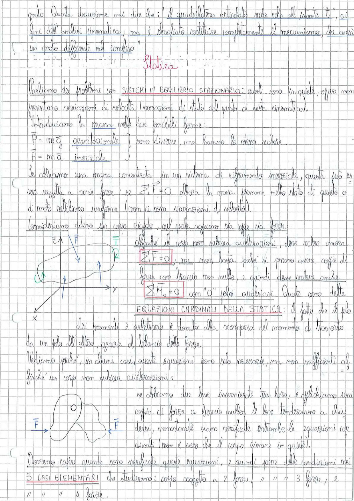

# Page 49 - Statica

---

*(continuazione dalla pagina precedente)*

gradi. Questa deduzione mi dice che: "il quadrilatero articolato vale nda all'istante $\bar{t}$", ai fini dell'analisi cinematica, ma è sbagliato sostituire completamente il meccanismo, che avrà un moto differente nel complesso.

---

## Statica

Parliamo dei problemi con **SISTEMI IN EQUILIBRIO STAZIONARIO**: questi sono in quiete, oppure non presentano variazioni di velocità (variazioni di stato dal punto di vista cinematico).

Introduciamo la massa nelle due possibili forme:

$$P = m\vec{g} \quad \text{gravitazionale}$$
$$F = m\vec{a} \quad \text{inerziale}$$

sono diverse, ma hanno lo stesso valore.

Se abbiamo una massa concentrata in un sistema di riferimento inerziale, questa può essere soggetta a varie forze: se $\sum \vec{F} = 0$ allora la massa permane nello stato di quiete o di moto rettilineo uniforme (non ci sono variazioni di velocità).

Consideriamo adesso un corpo rigido, sul quale agiscono sia coppie sia forze:

affinché il corpo non subisca accelerazioni, deve valere ancora

$$\boxed{\sum_i \vec{F} = 0}$$

ma non basta poiché si possono avere coppie di forze con braccio non nullo, e quindi deve valere anche

$$\boxed{\sum_i \vec{M}_O = 0} \quad \text{con "O" polo qualsiasi.}$$

Queste sono dette **EQUAZIONI CARDINALI DELLA STATICA**: il fatto che il polo dei momenti è arbitrario è dovuto alla scomparsa del momento di trasporto da un polo all'altro, grazie al bilancio delle forze.

> 
> Diagramma: corpo rigido con sistema di riferimento (x, y, z) soggetto a forze (N, T, peso) con vincoli

---

Vediamo perché, in alcuni casi, queste equazioni sono sole necessarie, ma non sufficienti affinché un corpo non subisca accelerazioni:

se abbiamo due leve incernierate tra loro, e applichiamo una coppia di forze a braccio nullo, le leve tenderanno a chiudersi, nonostante siano verificate entrambe le equazioni cardinali (non è vero che il corpo rimane in quiete).

> 
> Diagramma: due leve incernierate con coppia di forze $\vec{F}$ a braccio nullo applicate alle estremità

Dovremo capire quando sono verificate queste equazioni, e quindi porre delle condizioni nei **3 CASI ELEMENTARI** che studieremo: corpo soggetto a 2 forze, " " " 3 forze, e " " " 4 forze.
