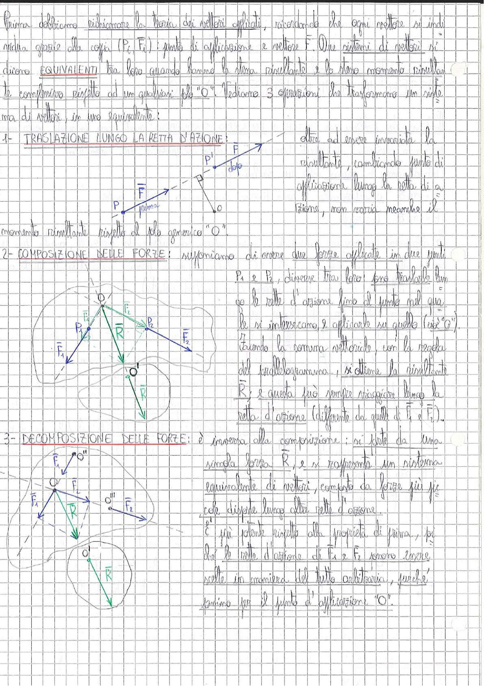

# Page 50 - Equivalenza di sistemi di vettori applicati

Prima dobbiamo richiamare la teoria dei vettori applicati, ricordando che ogni vettore si indica grazie alla coppia $(P, \vec{F})$: punto di applicazione e vettore $\vec{F}$. Due sistemi di vettori si dicono **EQUIVALENTI** tra loro quando hanno la stessa risultante e lo stesso momento risultante complessivo rispetto ad un qualsiasi polo "O". Vediamo 3 operazioni che trasformano un sistema di vettori in uno equivalente:

## 1 - Traslazione lungo la retta d'azione

> 
> Diagramma: Vettore $\vec{F}$ applicato nel punto P traslato lungo la sua retta d'azione fino al punto P', con polo generico O

Dato ad essere invariata la risultante, cambiando punto di applicazione lungo la retta di azione, non varia neanche il momento risultante rispetto al polo generico "O".

## 2 - Composizione delle forze

Supponiamo di avere due forze applicate in due punti $P_1$ e $P_2$, diverse tra loro: sono traslarle lungo le rette d'azione fino al punto nel quale si intersecano, e applicarle su quello (cfg. "O"). Facendo la somma vettoriale, con la regola del parallelogramma, si ottiene la risultante $\vec{R}$; e questa può sempre trasporsi lungo la retta d'azione (differente da quelli di $\vec{F}_1$ e $\vec{F}_2$).

> 
> Diagramma: Composizione di due forze $\vec{F}_1$ e $\vec{F}_2$ applicate in $P_1$ e $P_2$, traslate fino al punto di intersezione O delle rette d'azione, con risultante $\vec{R}$ ottenuta tramite regola del parallelogramma. Sotto: la risultante $\vec{R}$ traslata lungo la propria retta d'azione fino al punto O'

## 3 - Decomposizione delle forze

È inversa alla composizione: si parte da una singola forza $\vec{R}$, e si rappresenta un sistema equivalente di vettori, composto da forze più piccole disposte lungo altre rette d'azione.

È più potente rispetto alla proprietà di prima, perché le rette d'azione di $\vec{F}_1$ e $\vec{F}_2$ sono scelte in maniera del tutto arbitraria, purché passino per il punto d'applicazione "O".

> 
> Diagramma: Decomposizione di una forza $\vec{R}$ in due componenti $\vec{F}_1$ e $\vec{F}_2$ lungo rette d'azione arbitrarie passanti per il punto di applicazione O; con cerchi che rappresentano i vincoli e punti O', O'' sulle rette d'azione delle componenti
