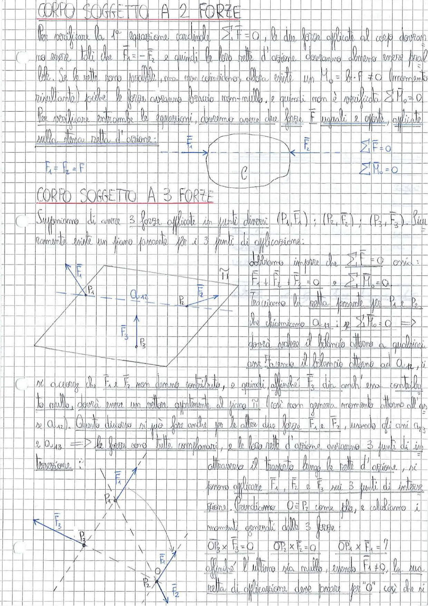

# Page 51 - Corpo soggetto a 2 e 3 forze

## Corpo soggetto a 2 forze

Per verificare la 1ª equazione cardinale $\sum \vec{F} = 0$, le due forze applicate al corpo dovranno essere tali che $\vec{F}_1 = -\vec{F}_2$ e quindi le loro rette d'azione dovranno almeno essere parallele. Se le rette sono parallele, ma non coincidono, allora esiste un $M_0 = b \cdot F \neq 0$ (momento risultante) poiché le forze avranno braccio non-nullo, e quindi non è verificata $\sum \vec{M}_0 = 0$.

Per verificare entrambe le equazioni, dovremo avere due forze $\vec{F}$ uguali e opposte, applicate sulla stessa retta d'azione:

$$F_1 = F_2 = F$$

> 
> Diagramma: Corpo C soggetto a due forze uguali e opposte $\vec{F}_1$ e $\vec{F}_2$ applicate sulla stessa retta d'azione, con condizioni $\sum F = 0$ e $\sum M_0 = 0$

---

## Corpo soggetto a 3 forze

Supponiamo di avere 3 forze applicate in punti diversi $(P_1, \vec{F}_1)$; $(P_2, \vec{F}_2)$; $(P_3, \vec{F}_3)$. Sicuramente esiste un piano passante per i 3 punti di applicazione.

Abbiamo imporre che $\sum \vec{F} = 0$ ossia:

$$\vec{F}_1 + \vec{F}_2 + \vec{F}_3 = 0 \qquad e \qquad \sum \vec{M}_0 = 0$$

Tracciamo la retta passante per $P_1$ e $P_2$ che chiamiamo $a_{12}$: se $\sum \vec{M}_0 = 0$ $\Rightarrow$ dovrà valere il bilancio attorno a qualsiasi asse. Facendo il bilancio attorno ad $a_{12}$, ci si accorge che $\vec{F}_1$ e $\vec{F}_2$ non danno contributo, e quindi affinché $\vec{F}_3$ dia anch'essa contributo nullo, dovrà essere un vettore appartenente al piano $\tilde{n}_1$ (così non genera momento attorno all'asse $a_{12}$). Questo discorso si può fare anche per le altre due forze $\vec{F}_1$ e $\vec{F}_2$, usando gli assi $a_{23}$ e $a_{13}$ $\Rightarrow$ le forze sono tutte complanari, e le loro rette d'azione avranno 3 punti di intersezione.

> 
> Diagramma: Corpo soggetto a 3 forze con punti di applicazione $P_1$, $P_2$, $P_3$, retta $a_{12}$ passante per $P_1$ e $P_2$, e piano $\tilde{n}_1$

Attraverso il trasporto lungo le rette d'azione, si possono applicare $\vec{F}_1$, $\vec{F}_2$ e $\vec{F}_3$ sui 3 punti di intersezione. Prendiamo $O \equiv P_2$ come polo, e calcoliamo i momenti generati dalle 3 forze:

$$\overline{OP}_3 \times \vec{F}_3 = 0 \qquad \overline{OP}_2 \times \vec{F}_2 = 0 \qquad \overline{OP}_1 \times \vec{F}_1 = \text{?}$$

Affinché l'ultimo sia nullo, essendo $\vec{F}_1 \neq 0$, la sua retta di applicazione deve passare per "O", così che si

> 
> Diagramma: Tre forze $\vec{F}_1$, $\vec{F}_2$, $\vec{F}_3$ complanari le cui rette d'azione si incontrano in un unico punto O, con punti di applicazione $P_1$, $P_2$, $P_3$
