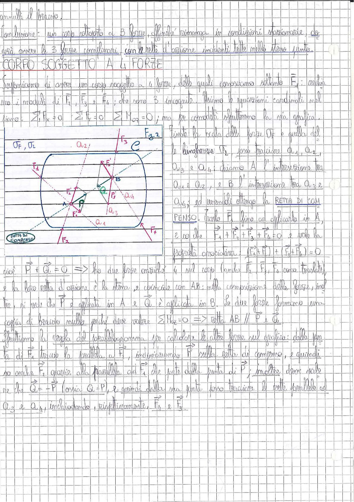

# Page 52 - Corpo soggetto a 4 forze

annulla il braccio.

**Conclusione:** un corpo sottoposto a 3 forze, affinché rimanga in condizioni stazionarie, dovrà avere le 3 forze complanari, con le rette d'azione incidenti tutte nello stesso punto.

## CORPO SOGGETTO A 4 FORZE

Supponiamo di avere un corpo soggetto a 4 forze, delle quali conosciamo soltanto $\vec{F}_1$: conosciamo i moduli di $\vec{F}_2$, $\vec{F}_3$ e $\vec{F}_4$; che sono 3 incognite. Abbiamo le equazioni cardinali nel piano:

$$\sum_i F_{ix} = 0 \qquad \sum_i F_{iy} = 0 \qquad \sum M_{O_2} = 0$$

ma per comodità sfrutteremo la via grafica.

> 
> Diagramma: corpo rigido con 4 forze ($\vec{F}_1$, $\vec{F}_2$, $\vec{F}_3$, $\vec{F}_4$) applicate lungo le rette d'azione $a_1$, $a_2$, $a_3$, $a_4$. Sono indicati i punti A (intersezione tra $a_1$ e $a_2$) e B (intersezione tra $a_3$ e $a_4$). La retta AB è la retta di compenso. Scale delle forze $\sigma_F$, $\sigma_L$ indicate.

Fissato la scala delle forze $\sigma_F$ e quella delle lunghezze $\sigma_L$, sono tracciate $a_1$, $a_2$, $a_3$ e $a_4$; chiamo A l'intersezione tra $a_1$ e $a_2$, e B l'intersezione tra $a_3$ e $a_4$; ed unendoli ottengo la **RETTA DI COMPENSO**. Traslo $\vec{F}_1$ fino ad applicarla in A, e so che:

$$\vec{F}_1 + \vec{F}_2 + \vec{F}_3 + \vec{F}_4 = 0$$

e vale la proprietà associativa:

$$\boxed{(\vec{F}_1 + \vec{F}_2) + (\vec{F}_3 + \vec{F}_4) = 0}$$

cioè $\vec{P} + \vec{Q} = 0$ $\Rightarrow$ ho due forze applicate al corpo (tanto $\vec{F}_1$, $\vec{F}_2$, $\vec{F}_4$ sono traslate), e la loro retta d'azione è la stessa, e coincide con AB: nella composizione delle forze, inoltre, si vede che $\vec{P}$ è applicata in A e $\vec{Q}$ è applicata in B. Le due forze formano una coppia di braccio nullo perché deve valere $\sum M_o = 0$ $\Rightarrow$ retta AB // $\vec{P}$ e $\vec{Q}$.

Sfruttiamo la regola del parallelogramma per calcolare le altre forze sul grafico: dalla punta di $\vec{F}_1$ traccio la parallela a $\vec{F}_2$, individuando $\vec{P}$ sulla retta di compenso, e quindi anche $\vec{F}_2$ grazie alla parallela ad $\vec{F}_4$ che parte dalla punta di $\vec{P}$; inoltre deve valere che $\vec{Q} = -\vec{P}$ (ossia $Q = P$), e quindi dalla sua punta posso tracciare le rette parallele ad $a_3$ e $a_4$, individuando, rispettivamente, $\vec{F}_4$ e $\vec{F}_3$.
